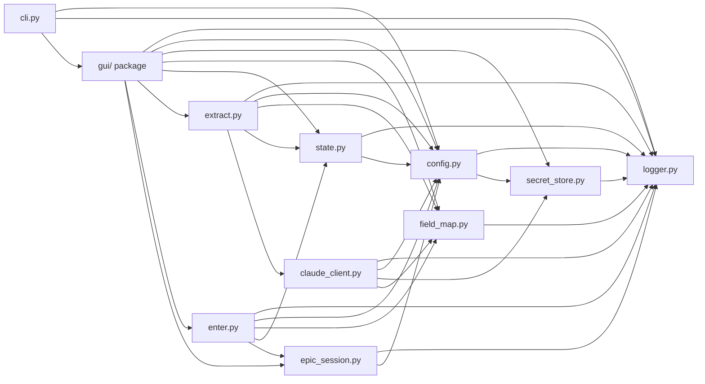

# ARCHITECTURE.md — IGA Marketing Master 2.0

**Status:** ✅ Finalized — synced to delivered surface (post-build)
**Mode:** v1, single-user, Windows-only, Path B (local disk, no SharePoint, no concurrency primitives)
**Authoritative plan:** [PLAN-REVIEW.md](PLAN-REVIEW.md) (✅ APPROVED with 17 amendments)
**Process map:** [PROCESS-MAP.md](PROCESS-MAP.md)
**Research:** [RESEARCH.md](RESEARCH.md) (decision A; Findings 2–5 adopted; Finding 1 rejected)
**Author:** Architecture Agent (initial), Architecture Finalization Agent (sync)
**Last updated:** 2026-04-30 (finalization)

This document is the contract that every developer agent codes against. If a developer agent finds a real conflict between this document and another artifact (or another agent's needs), they raise it via the orchestrator and the Architecture Agent rules. Until then, **this document is the source of truth for inter-module contracts**.

---

## 1. System Overview

IGA Marketing Master 2.0 is a single-user Windows desktop application that turns insurance PDFs into Applied EPIC entries. Five subsystems compose the application: the **Epic Field Map** (the static-but-enrichable model of EPIC's field universe, on disk at `Library/Epic Field Map.json`), the **Extractor** (Claude API client + per-document orchestration that produces structured records keyed by `domain_tag`), the **Canonical State** (per-client `state.json` that holds the merged, audited, human-edited result of all extractions for one client), the **Review GUI** (PySide6 application that lets a human approve, edit, lock, and resolve conflicts), and the **Entry Driver** (Playwright in persistent-context mode that walks approved fields and fills them into EPIC starting from a screen the user has navigated to manually).

Data flows in a single direction with one human gate: PDFs are dropped into the GUI, the Extractor sends them to Claude (Sonnet 4.6 default, auto-escalating to Opus 4.7 on low confidence / required-missing / `needs_review`), Claude returns `record_extracted_field` tool calls keyed by `domain_tag`, the Extractor merges them into `state.json` (detecting conflicts and writing per-field history), the GUI presents the result for human review, the user clicks Begin Entry, and the Entry Driver walks approved fields against the page the user is sitting on. EPIC validation rejections become operator-readable pauses; on resume the DOM is re-read as ground truth.

The architectural inversion vs v1 is the most important load-bearing decision: **EPIC's field universe is modeled first**, and every other artifact (the canonical state, the GUI sections, the Claude tool schema, the Playwright selector chain) is keyed off `domain_tag` IDs that point into the Field Map. v1 made Excel the source of truth, hard-coded coverages into the workflow, and could not generalize. v2 makes the Field Map the source of truth, treats Excel only as historical reference (`Testing and Example Library/Extracted.xlsx`), and treats `domain_tag` as a stable business-concept identifier that decouples Claude's extraction vocabulary from EPIC's selector vocabulary.

---

## 2. Naming Conventions (project-wide)

These apply to all Python source under `src/iga_marketing_master_2/` and all tests under `tests/`.

| Element | Convention | Examples |
|---|---|---|
| Module file names | `snake_case.py` | `field_map.py`, `epic_session.py`, `secret_store.py` |
| Package | single package | `iga_marketing_master_2` |
| Class names | `PascalCase` | `FieldRecord`, `OperatorModal`, `EpicSession`, `ExtractedField` |
| Functions / methods | `snake_case` | `load_field_map`, `merge_extraction`, `take_daily_snapshot` |
| Variables | `snake_case` | `pdf_path`, `cache_read_tokens` |
| Constants | `SCREAMING_SNAKE_CASE` (module-level) | `MAX_PAGES_PER_CALL`, `CONFIDENCE_LOW_THRESHOLD`, `SECRET_SERVICE_NAME` |
| Booleans | start with `is_` / `has_` / `should_` | `is_required`, `has_pending_pause`, `should_force_opus` |
| Private symbols | leading underscore | `_atomic_write`, `_resolve_locator_chain` |
| Test files | `test_<module>.py` | `tests/test_state.py`, `tests/test_field_map.py` |
| Test functions | `test_<behavior>` | `test_atomic_write_survives_kill_signal` |
| Logger names | `iga.<module>` | `iga.extract`, `iga.gui`, `iga.epic_session`, `iga.claude` |
| Type hints | required on all public APIs; Python 3.13 syntax | `list[ExtractedField]`, `str \| None`, `dict[str, FieldRecord]` |
| Path handling | `pathlib.Path` always; forward slashes only in code literals | `Path(working_library) / client / "state.json"` (never `working_library + "/" + client + ...`) |
| Exception types | end in `Error`; module-prefixed | `FieldMapValidationError`, `StateCorruptError`, `ClaudeCacheMissError` |
| `__all__` | every module exposing a public surface declares one | — |

**Type-hinting style (Python 3.13):** Use `X | None` (not `Optional[X]`), `list[T]` (not `List[T]`), `dict[K, V]` (not `Dict[K, V]`). Built-in generics are sufficient — do not import from `typing` for these. Use `typing.TypeAlias` for compound aliases used in multiple modules. Use `dataclasses.dataclass(slots=True, kw_only=True)` for record types unless `pydantic` is justified for a specific module (pydantic is approved for `state.py` schema validation if the agent finds it cleaner than a hand-rolled validator; otherwise stick to dataclasses).

**Forbidden patterns:**
- String concatenation for paths.
- `os.path.join` (use `pathlib.Path` operators).
- Bare `except:` clauses (always name the exception type).
- Mutable default arguments.
- `print()` for diagnostics — use `logging` via the module logger.

---

## 3. Domain Tag Namespacing Convention

This section **resolves PLAN-REVIEW open question #1** (`domain_tag` namespacing).

### 3.1 Grammar

```
domain_tag := namespace ( "." segment )+
namespace  := lowercase identifier corresponding to a top-level EPIC business area
segment    := lowercase identifier (a-z, 0-9, underscore); 1+ segments after the namespace
```

Rules:

1. **Lowercase only.** ASCII a–z, 0–9, and underscore (`_`) within a segment. No hyphens, no camelCase, no Unicode.
2. **Dot-separated.** Dots delimit hierarchy. There is at least one dot (one namespace + one segment minimum). Tags with three or more dots are normal for nested concepts (e.g., `account.address.line1`, `policy.gl.aggregate_limit`).
3. **No EPIC selector leakage.** Tags name *business concepts*, never EPIC's `name` attributes (`streName`, `cboState`, etc.). EPIC selectors live on the Field Map entry; the `domain_tag` is the stable business identifier that survives EPIC UI changes.
4. **Stable across renames.** Once a `domain_tag` is in production state files, it does not change shape. Adding aliases is fine; renaming is a migration.
5. **Repeatable groups share a prefix.** Every field that participates in a repeatable group has a `domain_tag` whose first segment after the namespace matches the group's `repeatable_group` value on the Field Map. E.g., a group named `vehicle` contains tags like `vehicle.year`, `vehicle.make`, `vehicle.vin`. The group container itself does not have a tag — it is referenced by `repeatable_group` on the constituent fields and surfaces in `state.repeatables[<group_name>]`.
6. **Coverage-line subnamespaces.** For coverage-line-specific fields (where the same business concept means different things per LOB), the second segment is the LOB code: `policy.gl.<concept>`, `policy.auto.<concept>`, `policy.property.<concept>`, `policy.workers_comp.<concept>`, `policy.umbrella.<concept>`, `policy.crime.<concept>`, `policy.cyber.<concept>`, `policy.inland_marine.<concept>`. LOB codes are short, stable, and chosen from a fixed list (see 3.3 below) — the Extractor and Field Map agents must agree on the list before Phase 2.
7. **Aliases are additive.** A Field Map entry may carry an `aliases: [...]` list of additional `domain_tag` strings that are accepted as input and normalized to the primary tag on read. Aliases never appear in `state.json`; only the primary tag does. (Used when the same business concept maps to multiple EPIC fields, or when an old tag is being retired in favor of a new canonical one.)

### 3.2 Top-level namespaces (the v1 vocabulary)

| Namespace | Domain | Example tags |
|---|---|---|
| `submission` | Marketing submission shell (the entry-point screen) | `submission.name`, `submission.effective_date`, `submission.expiration_date`, `submission.source` |
| `account` | Account / named insured shared identity | `account.named_insured`, `account.dba`, `account.fein`, `account.address.line1`, `account.address.city`, `account.address.state`, `account.address.zip`, `account.contact.primary.name`, `account.contact.primary.email` |
| `policy` | Policy / coverage data, sub-namespaced by LOB | `policy.gl.aggregate_limit`, `policy.auto.combined_single_limit`, `policy.property.building_value`, `policy.workers_comp.experience_mod` |
| `vehicle` | Auto schedule (repeatable) | `vehicle.year`, `vehicle.make`, `vehicle.model`, `vehicle.vin`, `vehicle.garaging_zip`, `vehicle.cost_new` |
| `driver` | Driver schedule (repeatable) | `driver.name`, `driver.license_number`, `driver.license_state`, `driver.date_of_birth` |
| `location` | Property / GL location schedule (repeatable) | `location.address.line1`, `location.address.city`, `location.address.state`, `location.square_footage`, `location.year_built`, `location.construction_type` |
| `loss_payee` | Additional interest schedule (repeatable) | `loss_payee.name`, `loss_payee.address.line1`, `loss_payee.interest_type` |
| `additional_insured` | AI schedule (repeatable) | `additional_insured.name`, `additional_insured.address.line1`, `additional_insured.relationship` |
| `prior_carrier` | Prior carrier history (repeatable) | `prior_carrier.name`, `prior_carrier.policy_number`, `prior_carrier.effective_date`, `prior_carrier.expiration_date`, `prior_carrier.premium` |
| `loss` | Loss history (repeatable) | `loss.date_of_loss`, `loss.amount_paid`, `loss.amount_reserved`, `loss.status`, `loss.description` |
| `producer` | Producer / servicing roles | `producer.lead_csr`, `producer.account_executive`, `producer.account_manager` |

**Repeatable namespaces** (`vehicle`, `driver`, `location`, `loss_payee`, `additional_insured`, `prior_carrier`, `loss`) are also their own `repeatable_group` values on the Field Map. The state file stores them under `state.repeatables[<group>]` as ordered arrays.

### 3.3 LOB codes (fixed list for `policy.<lob>.*`)

`gl`, `auto`, `property`, `workers_comp`, `umbrella`, `crime`, `cyber`, `inland_marine`, `professional`, `directors_officers`, `employment_practices`, `pollution`. Additions to this list require an Architecture Agent ruling (small change — log via orchestrator).

### 3.4 Worked examples

The following 18 examples span the major coverage domains and demonstrate the grammar in practice. Field Map entries with `domain_tag` set use exactly these strings; new tags proposed via JIT extend the vocabulary following the same shape.

| `domain_tag` | Meaning | Repeatable group? |
|---|---|---|
| `submission.name` | The submission's display name | No |
| `submission.effective_date` | Effective date of the submission | No |
| `account.named_insured` | The legal name of the insured | No |
| `account.address.line1` | Account mailing address, line 1 | No |
| `account.address.state` | Account mailing state (2-letter) | No |
| `account.fein` | Federal employer ID number | No |
| `policy.gl.aggregate_limit` | General liability per-policy aggregate | No |
| `policy.gl.each_occurrence_limit` | GL per-occurrence limit | No |
| `policy.auto.combined_single_limit` | Auto CSL | No |
| `policy.property.building_value` | Property building TIV | No (per-location version is `location.building_value`) |
| `policy.workers_comp.experience_mod` | Most recent experience modifier | No |
| `vehicle.year` | Vehicle model year | Yes — `vehicle` |
| `vehicle.vin` | Vehicle identification number | Yes — `vehicle` |
| `driver.license_number` | Driver license number | Yes — `driver` |
| `location.address.line1` | Property location address line 1 | Yes — `location` |
| `location.square_footage` | Location square footage | Yes — `location` |
| `loss_payee.name` | Loss payee's legal name | Yes — `loss_payee` |
| `prior_carrier.policy_number` | Prior carrier's policy number | Yes — `prior_carrier` |

### 3.5 JIT enrichment of new tags

When the Extractor encounters a Field Map entry without a `domain_tag` (or Claude proposes a tag not yet in the Field Map enum), the proposed tag is queued for human confirmation in the GUI. The user can **accept**, **edit** (e.g., correct a typo or namespace mismatch), or **reject**. On accept, `field_map.update_field(name=..., patch={"domain_tag": "..."})` is called and the JSON is atomically rewritten. The Extractor then regenerates the `record_extracted_field` tool's `domain_tag` enum on the next API call. (This is the source of the cache-bust behavior documented in `claude_client.py` per amendment #4.)

---

## 4. Epic Field Map — Schema (v1, full and final)

The on-disk JSON file at `Library/Epic Field Map.json` is the authoritative model of EPIC's field universe. It is committed to the repo and modified at runtime by JIT enrichment. Schema below is the v1 contract. **Existing keys are preserved exactly**; new keys are additive.

### 4.1 Top-level shape (existing — preserved)

The root is a JSON object whose keys are screen labels (or `"<Parent> > <Child>"` paths for nested screens). Each value is a screen object:

```jsonc
{
  "<screen-label>": {
    "level": 3,                              // existing — integer hierarchy depth
    "label": "Submission Detail",            // existing — human-readable
    "screen_code": "MKMMSDET",               // existing — EPIC's stable screen code
    "automation_id": "sidebar-button-...",   // existing — sidebar button locator
    "acord_form": "ACORD 146" | null,        // existing — optional ACORD form anchor
    "parent": "<Parent screen label>" | absent, // existing — set on nested screens
    "buttons": [ /* { label, container_title, format } */ ],  // existing
    "fields":  [ /* per-field objects, see 4.2 */ ],          // existing
    "tabs":    [ /* nested screens with same shape, plus optional sub_tabs[] */ ]  // existing
  },
  "...": { ... }
}
```

A `tab` object has the same shape as a screen object plus optional `selector` (CSS) and `tab_format` keys, and may contain `sub_tabs[]` (recursive). The Field Map agent **must traverse `tabs[]` and `sub_tabs[]` recursively** when scanning fields; field uniqueness is per `(screen_code, name)`, not per top-level screen.

### 4.2 Per-field shape

**Existing keys (preserved exactly — Field Map agent must not break these):**

| Key | Type | Required? | Source | Notes |
|---|---|---|---|---|
| `type` | `str` | yes | scrape | `"text"`, `"date"`, `"select"`, `"checkbox"`, `"textarea"`, etc. |
| `label` | `str` | yes | scrape | EPIC's visible label |
| `name` | `str` | yes | scrape | EPIC's `name` attribute (e.g., `"streName"`, `"cboState"`) |
| `required` | `bool` | yes (legacy) | scrape | Legacy "required" flag from the scraper. **Preserve, do not rely on.** Use `is_required` (4.3) for runtime decisions. |
| `format` | `str` | yes | scrape | `"old"` or `"new"` UI variant marker |
| `hint` | `str` | sometimes | scrape | Type hint: `"text"`, `"date"`, `"combo"`, `"integer"` |
| `disabled` | `bool` | sometimes | scrape | Field is disabled in UI |
| `readonly` | `bool` | sometimes | scrape | Field is read-only |
| `maxlength` | `int` | sometimes | scrape | UI maxlength attribute |

**New metadata keys (additive — written JIT or by the Field Map agent during enrichment):**

| Key | Type | Default if missing | Written by | Read by | Notes |
|---|---|---|---|---|---|
| `is_required` | `bool` | `false` | human or extractor (proposed) → human-confirmed | extract.py, gui.py | The trustworthy "is this required for entry" flag. Distinct from legacy `required`. |
| `is_repeatable` | `bool` | `false` | field_map.py (deduced from screen structure) or human | extract.py, state.py, gui.py | True if this field belongs to a repeatable group. |
| `repeatable_group` | `str \| null` | `null` | field_map.py or human | extract.py, state.py, gui.py | Group name (e.g., `"vehicle"`). If set, must match the namespace prefix of `domain_tag`. |
| `parent_field` | `str \| null` | `null` | human | extract.py, gui.py | The `name` (NOT domain_tag) of the parent field if this field is conditional on another. |
| `enum_values` | `list[str] \| null` | `null` | scrape or human | extract.py (validation), gui.py (dropdown) | For `select`/`combo` fields: the allowed values. |
| `validation_pattern` | `str \| null` | `null` | human | extract.py, enter.py | Optional regex the value must match (e.g., FEIN format, ZIP). |
| `depends_on` | `list[str] \| null` | `null` | human | extract.py | List of `domain_tag` values whose presence/value gates this field. |
| `default_value` | `str \| null` | `null` | human | extract.py, enter.py | Default if unspecified. |
| `domain_tag` | `str \| null` | `null` | human-confirmed via JIT | extract.py (enum gen), state.py (key), gui.py (display), enter.py (resolve) | THE link between Claude's vocabulary and EPIC's field universe. See §3. |
| `aliases` | `list[str]` | `[]` | human | extract.py, state.py | Alternate `domain_tag` strings accepted for this field. Normalized to primary on read. |
| `last_verified_at` | `str` (ISO-8601) \| null | `null` | enter.py (on successful selector resolve), field_map.py (on JIT enrichment) | gui.py (drift indicator), enter.py (pre-flight smoke decision) | When the selector last resolved successfully against EPIC. |
| `epic_build_version` | `str \| null` | `null` | enter.py (when known) | gui.py | EPIC build string captured at last verification. |
| `notes_for_claude` | `str \| null` | `null` | human | claude_client.py (interpolated into Field Map prompt block) | Extra hints for the Extractor. |

**Explicitly NOT in the schema:**

- **`version`** — Path B is single-user. Per amendment #11, no `version` field on the Field Map. Plain atomic write. No compare-and-swap.

### 4.3 `field_map.py` I/O contract

The `field_map` module exposes the following public surface. Signatures are normative.

```python
# All paths are absolute pathlib.Path; "patch" is a partial dict of new-metadata keys.

def load() -> FieldMap: ...
    # Reads Library/Epic Field Map.json from disk into an in-memory FieldMap.
    # Validates structural integrity; raises FieldMapValidationError on broken JSON
    # or missing required existing keys (type/label/name/format).
    # Does NOT validate semantic content of new metadata (those are advisory).
    # Idempotent; safe to call repeatedly.

def save_atomic(field_map: FieldMap) -> None: ...
    # Writes the FieldMap back to disk via tmp+os.replace. Updates a rolling
    # "Library/Epic Field Map.json.bak" before writing the new file.
    # Single-writer assumption (Path B); no locking.

def lookup_by_domain_tag(field_map: FieldMap, domain_tag: str) -> FieldEntry | None: ...
    # Returns the canonical entry for a domain_tag (resolves through aliases).
    # Returns None if not found (caller decides JIT vs error).

def lookup_by_name(field_map: FieldMap, screen_code: str, name: str) -> FieldEntry | None: ...
    # Lookup by (screen_code, name) — used for selector resolution and JIT proposal.

def fields_for_screen(field_map: FieldMap, screen_code: str) -> list[FieldEntry]: ...
    # Returns all leaf fields under a screen_code, recursing through tabs/sub_tabs.

def generate_domain_tag_enum(field_map: FieldMap) -> list[str]: ...
    # Returns the sorted list of all domain_tag values (excluding aliases) currently
    # populated. Used by claude_client.py to build the record_extracted_field tool.
    # Empty list is valid (means tool's domain_tag param is unconstrained — early v1 case).

def update_field(field_map: FieldMap, *, screen_code: str, name: str, patch: dict[str, object]) -> FieldEntry: ...
    # Applies a metadata patch to a single field (in-place on the FieldMap object).
    # Caller is responsible for save_atomic() after batching updates.
    # Raises FieldMapValidationError if patch contains unknown keys or invalid types.

def screens_touched_by_domain_tags(field_map: FieldMap, tags: list[str]) -> set[str]: ...
    # Returns the set of screen_codes that contain any field tagged with any of the
    # given tags. Used by enter.py for the pre-flight selector smoke (touched-screens-only).
```

`FieldMap` is a typed wrapper (dataclass or pydantic model) over the raw JSON dict that preserves round-tripping. `FieldEntry` is a typed view over a single field — the agent may implement this as a dataclass with optional fields or as a `TypedDict`; the choice is internal as long as the call sites work with a stable attribute API (`entry.domain_tag`, `entry.name`, `entry.label`, etc.).

### 4.4 Atomic write protocol (Field Map)

1. Compute new JSON bytes.
2. Copy current `Library/Epic Field Map.json` to `Library/Epic Field Map.json.bak` (overwrite previous bak).
3. Write new bytes to `Library/Epic Field Map.json.tmp`.
4. `os.replace("Library/Epic Field Map.json.tmp", "Library/Epic Field Map.json")`.
5. On any failure, the original file is intact (step 4 is atomic on Windows for files on the same volume).

The Field Map file lives in the git-tracked repo, not under `Working Library/`. JIT enrichment writes to the working copy; the user is expected to commit changes manually (this is intentional — the v1 user is the developer/operator).

### 4.5 JIT enrichment flow (proposal → confirmation → writeback)

1. **Trigger:** Extractor encounters a Field Map entry with `domain_tag = null` for a field Claude wants to record, OR Claude proposes a `domain_tag` not in the current enum.
2. **Proposal:** `extract.py` queues a `DomainTagProposal` carrying `(screen_code, name, label, proposed_tag, sample_value, source_doc, source_quote)`.
3. **GUI confirmation:** When the GUI processes the run, it surfaces a `DomainTagConfirmationDialog` (subclass of `OperatorModal`) showing the proposal and the surrounding context. The user accepts / edits / rejects.
4. **Writeback:** On accept, `field_map.update_field(...)` patches the entry; `field_map.save_atomic(...)` persists. The Extractor's running enum is invalidated; the next API call regenerates it (and may incur a one-time cache miss on the Field Map breakpoint).
5. **Logging:** Every proposal and outcome is logged to `iga.field_map` and to `<client>/runs.log`. Cache miss reasons attributable to JIT enrichment are tagged `cache_miss_reason="field_map_domain_tag_added"` per amendment #4.

---

## 5. Canonical state.json — Schema (per-client, v1)

Every client has exactly one `state.json` at `<Working Library>/<Client>/state.json`. It is the merged, audited, human-edited result of all extraction runs for that client. The Extractor writes into it; the GUI reads/edits it; the Entry Driver reads it (and writes per-field `status` updates as it enters each field successfully).

### 5.1 Top-level shape

Notation: TypeScript-ish for unambiguity. `?` means optional / nullable. Time fields are ISO-8601 strings (UTC, with offset).

```ts
type State = {
  schema_version: 1,                     // bumped on schema migrations; v1 = 1
  client: string,                        // canonical client name (= folder name)
  created_at: string,                    // ISO-8601
  updated_at: string,                    // ISO-8601, refreshed on every save
  run_history: RunHistoryEntry[],        // append-only, one entry per extraction or entry run

  fields: { [domain_tag: string]: FieldRecord },     // singleton fields keyed by domain_tag
  repeatables: { [group_name: string]: RepeatableItem[] },  // ordered lists of records

  pending_pause: PendingPause | null,    // non-null while an entry session is paused awaiting human
  pending_extraction: PendingExtraction | null,  // non-null after crash, if extraction was mid-flight
  pending_domain_tag_proposals: dict[]   // queued JIT domain_tag proposals awaiting GUI confirmation; defaults to []
}
```

```ts
type RunHistoryEntry = {
  run_id: string,           // uuid4
  ts: string,               // ISO-8601
  user: string,             // os.getlogin() at time of run
  kind: "extraction" | "entry" | "manual_edit",
  inputs: string[],         // for extraction: list of source PDF basenames; for entry/manual: empty
  model_used?: "sonnet-4-6" | "opus-4-7" | "mixed",   // extraction-only
  forced_opus?: boolean,    // extraction-only; true if --force-opus was used
  outcome: "completed" | "partial" | "aborted" | "paused",
  notes?: string
}

type FieldRecord = {
  value: string | number | boolean | null,
  confidence: number,           // 0.0–1.0; 1.0 if human-edited
  status: "pending" | "approved" | "locked" | "entered",
  source: SourceRef[],          // every source quote that contributed (current canonical first)
  conflicts: ConflictCandidate[],   // alternative values from other docs/runs/Claude calls
  history: HistoryEntry[],      // append-only
  model_used?: "sonnet-4-6" | "opus-4-7" | null,   // model that produced the canonical value
  needs_review: boolean         // mirror of Claude's flag, OR set by GUI on manual flag
}

type SourceRef = {
  doc_id: string,        // basename or hash of source PDF
  page: number,          // 1-indexed
  quote: string          // the literal text quoted from the PDF
}

type ConflictCandidate = {
  value: string | number | boolean | null,
  confidence: number,
  source: SourceRef,     // single source for this candidate
  model_used?: "sonnet-4-6" | "opus-4-7",
  observed_at: string    // ISO-8601 — when this candidate first appeared
}

type HistoryEntry = {
  run_id: string,
  ts: string,
  user: string,
  actor: "extractor" | "gui" | "entry",
  action: "create" | "update" | "approve" | "lock" | "unlock" | "enter" | "resolve_conflict",
  prior: { value: any, status: string, confidence: number } | null,
  new:   { value: any, status: string, confidence: number }
}

type RepeatableItem = {
  // A single row in a repeatable group (e.g., one vehicle).
  // Map of domain_tag → FieldRecord (same FieldRecord shape as above).
  // Convention: the repeatable item contains records whose domain_tag begins with the
  // group's namespace (e.g., a vehicle item has tags like "vehicle.year", "vehicle.vin").
  [domain_tag: string]: FieldRecord
}

type PendingPause = {
  run_id: string,
  paused_at: string,        // ISO-8601
  domain_tag: string,
  repeatable_group?: string,
  repeatable_index?: number,
  screen_code: string,
  reason_code: "validation_rejected" | "selector_unresolved" | "user_requested" | "exception",
  reason_message: string,   // operator-readable
  technical_detail: string  // selector chain output, exception text, etc. (for fold-out)
}

type PendingExtraction = {
  run_id: string,
  started_at: string,
  pdf_paths: string[],
  completed_pdf_basenames: string[],
  notes?: string
}
```

### 5.2 Repeatable group ordering

Items in `state.repeatables[group]` are ordered. Order is preserved across runs. New items appended on subsequent extractions; the GUI handles dedup / merge via a list-key strategy (e.g., for `vehicle`, the natural key is `vehicle.vin`; for `location`, it's the address tuple). The state-agent decides the per-group natural key set; document the choices in `STATUS_state-agent.md` for review.

### 5.3 `state.py` I/O contract

```python
def load(client_path: Path) -> State: ...
    # Reads <client_path>/state.json. If missing, returns a fresh State with
    # schema_version=1, client=<folder name>, empty collections.
    # If state.json is corrupt: tries state.json.bak; if both fail, tries the most
    # recent snapshots/state-YYYY-MM-DD.json. Logs every fallback. Raises StateCorruptError
    # only if all three fail.

def save_atomic(state: State, client_path: Path) -> None: ...
    # Atomic write protocol (see 5.4). Updates state.updated_at to now.
    # Triggers take_daily_snapshot internally if no snapshot for today exists yet.

def merge_extraction(state: State, claude_records: list[ExtractedField], run_id: str, model_used: str) -> MergeReport: ...
    # Merges a batch of Claude extractions into state.
    # Returns a MergeReport describing: fields_created, fields_updated, conflicts_added,
    # repeatable_items_added, domain_tag_proposals (for unknown tags).
    # Pure: mutates state in place; does NOT save. Caller calls save_atomic afterward.

def detect_conflicts(state: State, domain_tag: str, candidate: ExtractedField) -> ConflictDetection: ...
    # Compares a new extracted value against state.fields[domain_tag].value.
    # Returns enum: "no_existing", "match", "conflict", "lower_confidence_dropped".

def write_history_entry(state: State, *, domain_tag: str, run_id: str, actor: str, action: str, prior, new) -> None: ...
    # Appends to fields[domain_tag].history[]. Mutates in place.

def take_daily_snapshot(client_path: Path) -> Path | None: ...
    # If snapshots/state-YYYY-MM-DD.json does not exist for today, copies the current
    # state.json into it. Returns the snapshot path on creation, None if today's already exists.
    # Auto-prunes snapshots older than 30 days.

def get_pending_pause(state: State) -> PendingPause | None: ...
def set_pending_pause(state: State, pause: PendingPause | None) -> None: ...
    # Convenience accessors; setting None clears the pause (used on resume).

def get_pending_extraction(state: State) -> PendingExtraction | None: ...
def set_pending_extraction(state: State, pending: PendingExtraction | None) -> None: ...

def get_pending_domain_tag_proposals(state: State) -> list[dict]: ...
def set_pending_domain_tag_proposals(state: State, proposals: list[dict]) -> None: ...
    # JIT domain_tag proposals queued by the Extractor that have not yet been
    # confirmed by the operator. Surviving a crash means the GUI can re-surface
    # the DomainTagConfirmationDialog on next launch. The GUI's
    # DomainTagConfirmationDialog consumes this list and, on accept, calls
    # field_map.update_field() then field_map.save_atomic() then
    # set_pending_domain_tag_proposals(state, remaining) + state.save_atomic().
    # Each proposal dict has at least:
    #   {screen_code, name, label, proposed_tag, sample_value,
    #    source_doc, source_page, source_quote}
    # See extract.py's _proposal_to_dict for the canonical shape.

def append_run_history(state: State, entry: RunHistoryEntry) -> None: ...
```

**Note on `pending_domain_tag_proposals`:** This field and the getter/setter pair were added during build finalization to complete the JIT contract that `extract.py` had been calling via `getattr` fallback. With the helpers in place the Extractor durably persists proposals before handing off to the GUI; if the operator quits before confirming, the proposals are restored on next launch.

### 5.4 Atomic write protocol (state.json)

1. Serialize `state` to JSON bytes (canonical form: `indent=2`, sorted keys at the top level for diff-friendliness, UTF-8 no BOM).
2. If `state.json` exists: copy it to `state.json.bak` (overwrite previous bak).
3. Write new bytes to `state.json.tmp`.
4. `os.replace("state.json.tmp", "state.json")` — atomic on Windows for same-volume files.
5. Daily snapshot: if `snapshots/state-YYYY-MM-DD.json` does not exist for today's date, copy the freshly written `state.json` into it. Then prune any snapshot whose `YYYY-MM-DD` is older than 30 days from today.
6. **Single-user assumption:** there is no `state.json.lock`. Path B does not require concurrency primitives.

If step 4 fails (e.g., disk full, network drive drop), the prior `state.json` is intact and the in-memory `state` object is unchanged from the caller's perspective — the caller receives the underlying `OSError`. The GUI surfaces this via `OperatorModal` ("Couldn't save state — disk may be full or the Working Library folder may have disconnected. Your edits are still in memory; try again or pick a different folder.").

### 5.5 Resume-on-crash flow (uses `pending_extraction`)

1. Extractor sets `pending_extraction = {run_id, started_at, pdf_paths, completed_pdf_basenames=[]}` and `save_atomic` before calling Claude on the first PDF.
2. After each PDF completes successfully and is merged, append the basename to `completed_pdf_basenames` and `save_atomic`.
3. On clean completion, set `pending_extraction = None` and `save_atomic`.
4. On next GUI launch: if `state.pending_extraction is not None`, the GUI surfaces a recovery prompt ("Last run was interrupted after N of M PDFs. Resume from where it left off, or discard and restart?"). The user picks; `extract.py` is called with the remaining PDFs (or all of them, depending on choice).

---

## 6. Claude API Integration Contract (`claude_client.py`)

### 6.1 Public surface

```python
@dataclass(slots=True, kw_only=True)
class ExtractedField:
    domain_tag: str
    value: str | int | float | bool | None
    source_doc: str
    source_page: int
    source_quote: str
    confidence: float
    needs_review: bool = False
    repeatable_group: str | None = None
    repeatable_index: int | None = None
    model_used: str  # "sonnet-4-6" or "opus-4-7"

def extract_from_pdf(
    pdf_path: Path,
    field_map: FieldMap,
    glossary: str,
    system_prompt: str,
    *,
    force_opus: bool = False,
    run_id: str,
    debug_dir: Path | None = None,
) -> list[ExtractedField]: ...

def reextract_low_confidence_fields(
    fields: list[ExtractedField],
    pdf_path: Path,
    field_map: FieldMap,
    system_prompt: str,
    *,
    run_id: str,
    debug_dir: Path | None = None,
) -> list[ExtractedField]: ...
    # Per-field re-prompt against Opus 4.7. Used for confidence < 0.7 / needs_review /
    # required-missing fields. Returns replacement records with model_used="opus-4-7".
```

### 6.2 Tool-use contract

Single tool `record_extracted_field`. Input schema (regenerated per call from the live Field Map):

```jsonc
{
  "name": "record_extracted_field",
  "description": "Record one extracted insurance field, keyed by its domain_tag.",
  "input_schema": {
    "type": "object",
    "required": ["domain_tag", "value", "source_doc", "source_page", "source_quote", "confidence"],
    "properties": {
      "domain_tag":         { "type": "string", "enum": [<sorted list from field_map.generate_domain_tag_enum()>] },
      "value":              { "type": ["string", "number", "boolean", "null"] },
      "source_doc":         { "type": "string" },
      "source_page":        { "type": "integer", "minimum": 1 },
      "source_quote":       { "type": "string" },
      "confidence":         { "type": "number", "minimum": 0, "maximum": 1 },
      "needs_review":       { "type": "boolean" },
      "repeatable_group":   { "type": "string" },
      "repeatable_index":   { "type": "integer", "minimum": 0 }
    }
  }
}
```

If the Field Map has no `domain_tag` values populated yet (very early v1), the `enum` constraint is omitted and the tag is free-text — the Extractor then queues every recorded tag for JIT confirmation. Once at least one tag is populated, the enum is enforced.

### 6.3 Two prompt-cache breakpoints

Per-call `messages` structure (informal):

```
system: [
  { type: "text", text: "<stable system prompt + glossary + few-shot examples>",
    cache_control: { type: "ephemeral" } },        // Breakpoint 1
]

messages: [
  { role: "user", content: [
      { type: "text", text: "<Field Map block + notes_for_claude interpolations>",
        cache_control: { type: "ephemeral" } },    // Breakpoint 2
      { type: "document", source: { type: "base64", media_type: "application/pdf", data: <pdf bytes b64> } },
      { type: "text", text: "<per-call instructions; e.g., 'Extract all fields from the attached PDF and call record_extracted_field for each.'>" }
  ]}
]
```

**Both breakpoints must clear Sonnet 4.6's 2,048-token cache minimum** (per Finding 5). Breakpoint 1 (system + glossary + examples) is expected at 5–15K tokens; Breakpoint 2 (Field Map) is expected at 50–80K tokens. If either falls below 2,048, the Extractor logs a warning and continues (the request still succeeds, just at full input price).

### 6.4 Auto-escalation policy

After a Sonnet 4.6 extraction completes:

1. Collect every `ExtractedField` where: `confidence < CONFIDENCE_LOW_THRESHOLD` (0.7) OR `needs_review == True` OR `is_required(field_map, domain_tag) and value in (None, "", )`.
2. Call `reextract_low_confidence_fields(...)` on those and only those, against `claude-opus-4-7`, with the same system prompt and Field Map but a tighter user prompt ("These specific fields had low confidence — please look again and be precise. If you still cannot find them, return null with needs_review=true.").
3. Replace the original records with the Opus records. Set `model_used="opus-4-7"` on each replaced record.
4. `force_opus=True` bypasses step 1 and uses Opus on the first call for the whole document. The user surfaces this via a per-run "Force Opus" toggle (off by default).

`CONFIDENCE_LOW_THRESHOLD = 0.7` is a module-level constant in `claude_client.py`, finalized in Phase 2 per PLAN-REVIEW open question #3.

### 6.5 Cache verification + logging

Every `messages.create` response is inspected:

```python
usage = response.usage
cache_creation = usage.cache_creation_input_tokens   # int
cache_read     = usage.cache_read_input_tokens        # int
input_tokens   = usage.input_tokens
output_tokens  = usage.output_tokens
logger.info(
    "claude.call",
    extra={"run_id": run_id, "model": model, "input_tokens": input_tokens,
           "output_tokens": output_tokens, "cache_creation": cache_creation,
           "cache_read": cache_read, "doc": pdf_path.name}
)

if cache_creation == 0 and cache_read == 0 and expected_cached:
    logger.warning("claude.cache_miss",
                   extra={"reason": cache_miss_reason, "doc": pdf_path.name, "run_id": run_id})
```

`cache_miss_reason` candidates: `"first_call_in_session"`, `"field_map_domain_tag_added"` (set by Extractor when JIT fired since last call), `"field_map_modified"`, `"system_prompt_changed"`, `"under_2048_tokens"` (when the relevant breakpoint's token count is below threshold), `"unknown"`.

### 6.6 PDF preflight + split

Before any API call:

1. Open with `pypdf.PdfReader(pdf_path)`. Capture `page_count` and `Path.stat().st_size`.
2. If `page_count <= MAX_PAGES_PER_CALL` (80) AND `size_bytes <= MAX_BYTES_PER_CALL` (32 * 1024 * 1024 — Anthropic's 32 MB ceiling): proceed with single call.
3. Otherwise: split into chunks of 80 pages each, with 1-page overlap (chunk N's last page = chunk N+1's first page). Each chunk is written to a temp file under `<client>/debug/split/<run_id>/`. Run extraction on each chunk independently.
4. Merge: union the resulting `ExtractedField` lists. Dedup by `(domain_tag, repeatable_group, repeatable_index)`. On dedup conflicts, prefer the higher confidence; the lower-confidence value flows to `state.fields[...].conflicts[]` via `merge_extraction`.
5. Log split decisions via `iga.claude` and to `<client>/runs.log`: `"split_pdf"` with `{pdf, page_count, size_bytes, chunks: [{start_page, end_page, basename}, ...]}`.

Constants in `claude_client.py`: `MAX_PAGES_PER_CALL = 80`, `MAX_BYTES_PER_CALL = 32 * 1024 * 1024`, `PAGE_OVERLAP = 1`.

### 6.7 Debug logging

When `Settings.debug == True`, every API request and response is dumped to:

```
<Working Library>/<Client>/debug/claude/<run_id>/<doc_id>-<call_n>.req.json
<Working Library>/<Client>/debug/claude/<run_id>/<doc_id>-<call_n>.resp.json
```

`req.json` includes the full request body (with PDF base64 elided to a hash; the original PDF stays in the original path). `resp.json` is the raw response (including `usage`, `stop_reason`, all `tool_use` blocks). Auto-prune: keep only the last 5 `<run_id>` directories per client.

### 6.8 Errors and retry

Anthropic SDK errors are surfaced as a small typed hierarchy:

```python
class ClaudeError(Exception): ...
class ClaudeAuthError(ClaudeError): ...        # 401, 403
class ClaudeRateLimitError(ClaudeError): ...   # 429 — caller may retry with backoff
class ClaudeServerError(ClaudeError): ...      # 5xx — caller may retry
class ClaudePDFTooLargeError(ClaudeError): ... # caught and resolved internally via split
class ClaudeCacheMissError(ClaudeError): ...   # NEVER raised; cache miss is a warning, not an error
```

Retry policy: `extract_from_pdf` retries `ClaudeRateLimitError` and `ClaudeServerError` with exponential backoff (1s, 2s, 4s, 8s; 4 attempts max). On `ClaudeAuthError`, the GUI surfaces a "re-enter API key" prompt (per amendment #7's "API key expired / revoked" risk row).

---

## 7. Entry Driver Contract (Playwright — `epic_session.py` + `enter.py`)

### 7.1 Public surface (`epic_session.py`)

```python
def cleanup_user_data_dir_lock(user_data_dir: Path) -> None: ...
    # Runs BEFORE every launch_with_persistent_context. Inspects user_data_dir for
    # SingletonLock, LOCK, lockfile, etc. For each, checks the recorded PID; if the
    # PID is not a live process (psutil.pid_exists), deletes the file. Logs every
    # action. Per amendment #16 + Finding 4. Idempotent; safe to call always.

def launch_with_persistent_context(user_data_dir: Path, *, headed: bool = True) -> BrowserContext: ...
    # Calls cleanup_user_data_dir_lock first, then playwright.chromium.launch_persistent_context.
    # user_data_dir MUST be absolute (Playwright #34700). Raises EpicSessionError on lock
    # contention that survives cleanup.

def resolve_locator(page: Page, field_entry: FieldEntry) -> tuple[Locator, str]: ...
    # Selector resolution chain:
    #   1. data-automation-id → [data-automation-id="<entry.automation_id>"] if present
    #   2. name attribute → [name="<entry.name>"]
    #   3. label fallback → page.get_by_label(entry.label, exact=True)
    # Returns (Locator, strategy_used) where strategy_used is one of:
    #   "automation_id", "name", "label_fallback".
    # If all three fail, raises SelectorUnresolvedError carrying the chain attempts.
```

### 7.2 Public surface (`enter.py`)

```python
@dataclass(slots=True, kw_only=True)
class EntryResult:
    run_id: str
    fields_entered: int
    fields_skipped: int
    fields_paused: int
    outcome: Literal["completed", "paused", "aborted"]
    pause_reason: PendingPause | None  # set if outcome == "paused"

def run_entry_session(
    state: State,
    field_map: FieldMap,
    browser_context: BrowserContext,
    *,
    on_pause_callback: Callable[[PendingPause], Literal["resume", "abort", "skip"]],
    on_progress_callback: Callable[[str, int, int], None] | None = None,
    debug_dir: Path | None = None,
) -> EntryResult: ...
    # Walks state.fields + state.repeatables in deterministic order:
    #   1. Compute the set of approved fields (status="approved"; "locked" fields skipped
    #      with a log line; "entered" fields skipped silently — resume case).
    #   2. Pre-flight selector smoke (see 7.3) on touched screens only.
    #   3. For each field: resolve_locator → fill → wait for EPIC validation → on success,
    #      set status="entered", history entry with actor="entry", action="enter".
    #   4. On selector-unresolved or validation-rejected: build a PendingPause, set it on
    #      state, save_atomic, and call on_pause_callback. The callback is synchronous
    #      from enter.py's perspective; it returns when the user has resumed/aborted/skipped.
    #      On "resume": re-read DOM via locator.input_value(); if present, treat as canonical
    #      and write a history entry with prior=<extracted value>, new=<dom value>, actor="entry",
    #      action="resolve_conflict". Continue walking.
    #      On "skip": leave the field at status="approved" with a notes-for-this-run entry; continue.
    #      On "abort": set EntryResult.outcome="aborted" and return.
```

### 7.3 Pre-flight selector smoke (touched screens only)

At the start of `run_entry_session`, after pre-flight smoke is enabled per amendment #6:

1. `tags_to_enter = {f.domain_tag for f in approved_fields}`
2. `screens = field_map.screens_touched_by_domain_tags(field_map, tags_to_enter)`
3. For each `screen_code in screens`: navigate (if not already there — best-effort), enumerate the leaf fields whose `domain_tag` is in `tags_to_enter`, attempt selector resolution **without filling**. Record per-field: `resolved=True/False`, `strategy_used`, `time_ms`.
4. Surface the result as a non-blocking warning banner if any selector failed: "{N} selectors look stale — drift may slow this run." The user clicks Continue and the entry proceeds; the warning stays as a yellow banner during the run (per amendment #7's "pre-flight smoke blindness" row).
5. Successful resolutions update each field's `last_verified_at` on the Field Map (write batched and saved at end of pre-flight).

Target time budget: 2–5 seconds. If pre-flight runs over 30 seconds, log a warning and proceed.

### 7.4 Pause-for-human contract

When `enter.py` cannot fill a field cleanly:

1. Build a `PendingPause` (5.1).
2. `state.set_pending_pause(state, pause); state.save_atomic(state, client_path)` — durably persisted before the modal opens, so a crash mid-pause doesn't lose context.
3. Call `on_pause_callback(pause)`. The GUI's callback opens an `OperatorModal` dialog (see §8).
4. The callback returns `"resume" | "abort" | "skip"`.
5. On `"resume"`: re-read DOM via `locator.input_value()`. If the DOM value is non-empty, use it as ground truth (write `resolve_conflict` history entry). If empty, treat as user gave up; mark field `status="pending"` and continue.
6. On `"skip"`: leave the field's `status="approved"` (un-entered); continue.
7. On `"abort"`: set `EntryResult.outcome="aborted"`, clear `pending_pause` (the user is done with this run; pause context is no longer relevant), save, return.
8. After the callback returns (resume/skip), clear `state.pending_pause` and save.

### 7.5 Playwright pinning + paths

- `playwright >= 1.55` (per amendment #16; pinned in `requirements.txt`).
- `user_data_dir` is **always absolute** (Playwright #34700). Default: `Path(platformdirs.user_data_dir("IGA Marketing Master")) / "playwright-profile"`.
- Browser: Chromium (the bundled Playwright build). Never Edge or Chrome. Never CDP attach.
- Headed only in v1 (operator must see EPIC). `headed=False` is reserved for v1.5.

### 7.6 Debug + tracing

When `Settings.debug == True`:

```python
context.tracing.start(screenshots=True, snapshots=True, sources=True)
# ... enter session ...
context.tracing.stop(path=debug_dir / f"trace-{run_id}.zip")
```

Plus per-action screenshots before and after each fill, saved under `<client>/debug/playwright/<run_id>/{n:04d}-{action}-{phase}.png`. Auto-prune to last 5 runs per client.

---

## 8. GUI Contract (PySide6 — `gui.py`)

The GUI is the only operator-facing surface. The internal widget tree is the gui-agent's call; this section codifies what other modules can rely on.

### 8.1 Application entry

```python
class IgaApp:
    @classmethod
    def run(cls, *, debug: bool = False) -> int: ...
        # Constructs QApplication, instantiates the main window, runs the event loop.
        # Returns the QApplication exit code (passed back to cli.py).
```

Invoked from `cli.py`'s `main()`. `IgaApp.run(debug=True)` is the `--debug` entry point.

### 8.2 Main window

The main window provides, at minimum:

- **Client picker** (top-left): picks an existing client folder from Working Library or creates a new one (folder name = client name).
- **File drop zone** (top): drag-drop or browse for 1-N PDFs. Triggers `extract.py`'s extraction loop on submit.
- **Section tabs** (center): one tab per major EPIC section (Submission, Account, Policy lines, Vehicle schedule, Driver schedule, Location schedule, etc.). Tabs are derived from the populated `state.fields` and `state.repeatables` keys, mapped through the Field Map's screen taxonomy.
- **PDF preview pane** (right): `QPdfView` from `PySide6.QtPdf` (NOT `QWebEngineView`). On cell focus, `pageNavigator().jump(field.source[0].page)`.
- **Audit log pane** (bottom): `QPlainTextEdit` showing per-run events (extraction start/end, conflicts surfaced, fields approved/edited/locked, entry session events). Read-only.
- **Run controls** (bottom toolbar): Begin Entry, Force Opus toggle, Cancel/Abort, Resume (visible during a paused entry session).

### 8.3 `OperatorModal` widget class (mandatory — per amendment #5)

`gui.py` exposes `OperatorModal` as a `QDialog` subclass. Every error / conflict / pause / API-key prompt UI is a `OperatorModal` subclass or instance. The 4-part structure is enforced by the constructor:

```python
class OperatorModal(QDialog):
    def __init__(
        self,
        parent: QWidget | None,
        *,
        headline: str,           # plain English, no jargon, ≤ 80 chars
        what_to_do: str,         # imperative steps the operator can take now
        cancel_effect: str,      # what happens if they click Cancel
        technical_detail: str | None = None,  # collapsible fold-out; selectors / exceptions / etc.
        actions: list[OperatorAction] = ...,  # buttons; defaults to [Resume, Cancel] for pauses
    ): ...
```

Visual structure (top to bottom): big bold headline; bullet list of what-to-do steps; small italic line for cancel-effect; collapsed "Show technical details" expander showing the technical_detail string. Buttons at the bottom in the order specified by `actions`. Forbidden in `headline` or `what_to_do`: selector strings, exception names, file paths longer than the file's basename, internal variable names.

**Subclasses provided:**

- `DomainTagConfirmationDialog(OperatorModal)` — JIT tag proposal (§4.5).
- `ConflictResolutionDialog(OperatorModal)` — surfaces `field.conflicts[]` candidates, click-to-pick.
- `EpicValidationPauseDialog(OperatorModal)` — opened from `on_pause_callback` when EPIC rejects a value.
- `SelectorUnresolvedPauseDialog(OperatorModal)` — opened when the selector chain fails entirely.
- `ApiKeyPromptDialog(OperatorModal)` — first-run prompt + re-prompt on `ClaudeAuthError`.
- `RecoverInterruptedRunDialog(OperatorModal)` — opens when `state.pending_extraction is not None` on launch.

### 8.4 Per-section table

- `QTableView` per section.
- Custom `QAbstractTableModel` that wraps the relevant slice of `state.fields` (or one item from `state.repeatables[group]`).
- `QStyledItemDelegate` editors per `type`/`hint` from the Field Map: text, date (calendar popup), select (dropdown with `enum_values`), checkbox.
- Cell background colored by confidence:
  - `confidence < 0.6` → red
  - `0.6 <= confidence < 0.85` → yellow
  - `confidence >= 0.85` → no tint
  - Manually edited fields (history shows `actor="gui", action="update"`) → confidence = 1.0, no tint.
- Opus badge column: small icon when `model_used == "opus-4-7"`.
- Source column: clickable; clicking jumps the PDF preview to `field.source[0]`.

### 8.5 Repeatable groups

Per amendment / convention: **list+form pattern, NOT nested grids**.

- Left side: `QListWidget` showing each item by a sensible per-group label (e.g., for `vehicle`: `"<year> <make> <model>"`; for `loss_payee`: `"<name>"`).
- Right side: a form with the same delegate-editor pattern as 8.4, bound to the selected list item.
- Add / Delete / Reorder buttons under the list.

### 8.6 Conflict UI

When `field.conflicts[]` is non-empty:

- The cell shows a small chevron indicator.
- Clicking the chevron opens `ConflictResolutionDialog` (an `OperatorModal`) showing all candidates: `value`, `confidence`, `source.doc_id`/`source.page` (clickable to PDF preview), `model_used`.
- The user clicks one candidate to promote it; promoted candidate becomes `field.value`; previous canonical moves to `conflicts`. History entry written with `action="resolve_conflict"`.

### 8.7 GUI ↔ other modules

- GUI calls `extract.run_extraction(client_path, pdf_paths, ...)` synchronously from a worker thread (so the UI stays responsive). Progress streamed via a callback that updates the audit log pane.
- GUI provides `on_pause_callback` to `enter.run_entry_session(...)`. Implementation: opens the appropriate pause `OperatorModal` on the main thread (Qt invokeMethod), blocks the worker thread until the modal closes, returns the user's choice.
- GUI never touches the file system except via `state.py` and `field_map.py`. No direct JSON I/O.

### 8.8 Operator-facing copy guidelines

(Codified once because every developer agent will write strings.)

- Headlines name the **outcome**, not the **mechanism**: "EPIC didn't accept 'GA' for State." (good); "Locator failed on input.streState." (bad — that goes in `technical_detail`).
- What-to-do is imperative and concrete: "Open the State dropdown in EPIC, pick the right value, then click Resume." (good); "Resolve the validation error." (bad).
- Never expose `domain_tag` strings to the operator without the human label. Use the Field Map's `label`. (Internal logs can use `domain_tag` freely.)
- Never expose selector strings, `name` attribute strings, exception class names, or file paths in the headline or what-to-do.

---

## 9. CLI / Config / Secret-Store / Logging Contract

### 9.1 CLI (`cli.py`)

Single command, single subcommand-less entry point.

```
iga-marketing-master-2 [--debug] [--working-library PATH] [--client NAME]
```

```python
def main() -> int: ...
    # Parses argv, builds Settings, calls IgaApp.run(debug=settings.debug).
    # Returns the exit code from IgaApp.run.
```

Flags:

- `--debug` — sets `Settings.debug = True`. Enables verbose logging, console handler, Playwright tracing, all debug artifacts retained.
- `--working-library PATH` — overrides the default Working Library for this invocation. (Persisted? No — for this run only.)
- `--client NAME` — auto-selects a client on launch (skips the picker).

### 9.2 Config (`config.py`)

```python
@dataclass(slots=True, kw_only=True, frozen=True)
class Settings:
    debug: bool
    working_library: Path           # absolute
    user_config_dir: Path           # absolute; ~ platformdirs.user_config_dir("IGA Marketing Master")
    user_data_dir: Path             # absolute; ~ platformdirs.user_data_dir("IGA Marketing Master")
    playwright_profile: Path        # absolute; user_data_dir / "playwright-profile"
    field_map_path: Path            # absolute; <repo>/Library/Epic Field Map.json
    log_dir: Path                   # absolute; user_data_dir / "logs"

def load_settings(*, cli_overrides: dict[str, object] | None = None) -> Settings: ...
    # Discovery order (highest priority first):
    #   1. cli_overrides (passed from cli.py)
    #   2. <user_config_dir>/config.json (persisted user choices)
    #   3. defaults (computed via platformdirs)
    # If <user_config_dir>/config.json does not exist, this is the first run; the
    # GUI shows a first-run picker for working_library and persists the choice.

def save_user_config(settings: Settings) -> None: ...
    # Writes the persistable subset (working_library, etc.) to <user_config_dir>/config.json.

DEFAULT_WORKING_LIBRARY = lambda: Path(platformdirs.user_documents_dir()) / "IGA Marketing Master" / "Working Library"
DEFAULT_PLAYWRIGHT_PROFILE = lambda: Path(platformdirs.user_data_dir("IGA Marketing Master")) / "playwright-profile"
```

The `field_map_path` is computed relative to the package install location (the repo root in dev; the installed location in production). The Working Library is **never** under the package install location.

### 9.3 Secret store (`secret_store.py`)

Thin wrapper over the `keyring` library (per amendment #14). Service name and username are constants:

```python
SECRET_SERVICE_NAME = "IGA Marketing Master"
SECRET_USERNAME_API_KEY = "anthropic_api_key"
ENV_OVERRIDE_API_KEY = "ANTHROPIC_API_KEY"

class SecretStoreError(Exception): ...
    # Typed wrapper around keyring.errors.KeyringError. Raised on backend failure.

def get_anthropic_api_key() -> str | None: ...
    # 1. If os.environ[ENV_OVERRIDE_API_KEY] is set and non-empty → return it.
    # 2. Else keyring.get_password(SECRET_SERVICE_NAME, SECRET_USERNAME_API_KEY).
    # 3. If neither, return None.

def set_anthropic_api_key(value: str) -> None: ...
    # keyring.set_password(SECRET_SERVICE_NAME, SECRET_USERNAME_API_KEY, value).
    # Raises SecretStoreError on backend failure.

def delete_anthropic_api_key() -> None: ...
    # For "change my key" / re-prompt flows.

def prompt_for_anthropic_api_key_via_console(*, set_after: bool = True) -> str | None: ...
    # Reads a key from stdin via getpass for headless / CI / power-user contexts.
    # If set_after=True (default), persists the entered key via set_anthropic_api_key.
    # Returns the entered value, or None on EOF / empty input.
```

The env-var override is for power users / CI / debugging — it's never written by the app, only read.

**Prompt-UI ownership.** The initial architecture proposed a `prompt_for_anthropic_api_key_via_gui(parent_widget)` function on `secret_store.py`. That function was **removed during build** because importing PySide6 from `secret_store` would violate §11's dependency graph (`gui → secret_store` is one-way; `secret_store` cannot import from `gui`). The GUI prompt is instead owned by `gui.operator_modal.ApiKeyPromptDialog` (one of the six concrete `OperatorModal` subclasses listed in §8.3). On accept, `ApiKeyPromptDialog` calls `secret_store.set_anthropic_api_key(value)` directly. The console-mode fallback (`prompt_for_anthropic_api_key_via_console`) lives in `secret_store.py` and is used by bootstrap / headless / CI paths where Qt is not available.

### 9.4 Logging (`logger.py`)

```python
def configure_logging(settings: Settings) -> None: ...
    # Configures the root "iga" logger and per-module children.
    # Always: rotating file handler at <log_dir>/iga.log (10 MB × 5 backups).
    # When debug: console handler at DEBUG; otherwise file handler at INFO.
    # Format: "%(asctime)s %(levelname)s %(name)s %(message)s" with extras as JSON suffix.

def get_logger(name: str) -> logging.Logger: ...
    # Returns logging.getLogger(f"iga.{name}").

def configure_run_log(client_path: Path) -> logging.Logger: ...
    # Per-run / per-client logger. Adds a FileHandler at <client_path>/runs.log to
    # the iga.run logger. Used for events scoped to a particular client run.
```

Per-module logger names (referenced throughout this doc): `iga.cli`, `iga.config`, `iga.secret_store`, `iga.field_map`, `iga.state`, `iga.claude`, `iga.extract`, `iga.gui`, `iga.epic_session`, `iga.enter`, `iga.run` (per-client).

---

## 10. Cross-Cutting: the `--debug` Discipline

When `Settings.debug == True`, every module behaves as follows:

| Module | Debug behavior |
|---|---|
| `claude_client` | Writes raw req/resp JSON to `<client>/debug/claude/<run_id>/<doc_id>-<call_n>.{req,resp}.json`; logs `usage` block; auto-prune to last 5 run_ids per client |
| `enter` | `tracing.start(screenshots=True, snapshots=True, sources=True)`; saves `trace-<run_id>.zip` to `<client>/debug/playwright/<run_id>/`; per-action screenshots before/after; auto-prune to last 5 run_ids |
| `epic_session` | Verbose locator-resolution logs (which strategy fired per call) |
| `state` | Logs every save via `iga.state` at INFO level (not DEBUG); also appends to `<client>/runs.log` |
| `field_map` | Logs every JIT enrichment / save via `iga.field_map` |
| `extract` | Logs full per-PDF processing including merge decisions |
| `gui` | No extra debug behavior (the operator sees normal UI; debug is for backend visibility) |
| `cli`, `config`, `logger`, `secret_store` | Console handler set to DEBUG level via `configure_logging` |

**Auto-prune policy:** per-client `debug/` subdirectories keep the last 5 `<run_id>` folders. Older directories are deleted on the next debug-enabled run.

When `Settings.debug == False`, no `<client>/debug/` artifacts are written. The `runs.log` file is still maintained per client (it's part of normal operation).

---

## 11. Module Dependency Graph

> **Note on `gui` packaging.** The initial spec described `gui.py` as a single file. During build, the gui-agent restructured it to a `gui/` subpackage (Python disallows a same-named module + package side-by-side). The canonical entry is `src/iga_marketing_master_2/gui/__init__.py`, which re-exports the full public surface (`IgaApp`, `OperatorModal`, the six dialog subclasses, the model/view/widget classes, `OperatorAction`, `OperatorActionRole`, `PauseChoice`). `from iga_marketing_master_2.gui import IgaApp` and `from iga_marketing_master_2 import gui` both resolve. Internal modules: `main_window.py`, `operator_modal.py`, `section_table.py`, `repeatable_pane.py`, `pdf_preview.py`, `audit_log.py`, `run_controls.py`. The dependency graph below treats the package as a single node (`gui`) — its internal layout does not affect inter-module contracts.



**Cycle check:** acyclic. `gui.py` is the orchestration top; `cli.py` is the entry point.

**Forbidden edges:**

- Nothing in `field_map`, `state`, `claude_client`, `epic_session`, `enter`, or `extract` may import `gui`. (GUI is a consumer, not a service.)
- `claude_client` may not import `state` or `extract`. (It only knows about `field_map` for enum generation.)
- `epic_session` may not import `enter` or `state`. (It exposes primitives; `enter` composes them.)

---

## 12. Data Flow Narrative — Bobby Luttrell & Sons

Andrew has three PDFs on his desk: a renewal dec from the prior carrier, a current schedule of vehicles, and a loss run. He launches **IGA Marketing Master 2.0**.

`cli.py` boots the app: parses argv (no flags today), `config.load_settings()` discovers the persisted Working Library (`C:/Users/Andrew/Documents/IGA Marketing Master/Working Library/`), `logger.configure_logging(settings)` sets up file logging, `secret_store.get_anthropic_api_key()` returns Andrew's stored key (he set it on first run via `ApiKeyPromptDialog`). `IgaApp.run()` constructs the main window.

Andrew types **Bobby Luttrell & Sons** into the client picker. The GUI calls `state.load(working_library / "Bobby Luttrell & Sons")`. Folder doesn't exist yet, so a fresh `State` object is returned with `client="Bobby Luttrell & Sons"` and empty collections. Andrew drags the three PDFs into the drop zone.

The GUI worker thread calls `extract.run_extraction(client_path, pdf_paths, settings)`. `extract.py`:

1. Calls `field_map.load()` (one-time per session). Generates the current `domain_tag` enum via `field_map.generate_domain_tag_enum()`.
2. Sets `state.pending_extraction = PendingExtraction(run_id=..., pdf_paths=[...], completed_pdf_basenames=[])`, `state.save_atomic()` (durable resume point).
3. For each PDF, calls `claude_client.extract_from_pdf(pdf_path, field_map, glossary, system_prompt, run_id=...)`:
   - PDF preflight: 12 pages, 4 MB — single call.
   - Two cache breakpoints set on system block + Field Map block.
   - Claude returns ~40 `record_extracted_field` tool calls. Sample: `{domain_tag: "account.named_insured", value: "Bobby Luttrell & Sons LLC", source_doc: "renewal-dec.pdf", source_page: 1, source_quote: "Named Insured: Bobby Luttrell & Sons LLC", confidence: 0.97}`.
   - Loss run had three losses → `record_extracted_field` called 3× per loss with `repeatable_group="loss"`, `repeatable_index=0/1/2`.
   - First call: `cache_creation_input_tokens=72_341`; subsequent two PDFs: `cache_read_input_tokens=72_341` (cache hits, logged as `iga.claude` INFO).
4. After Sonnet pass: 3 fields have `confidence < 0.7`, 1 has `needs_review=True`. `claude_client.reextract_low_confidence_fields(...)` runs Opus 4.7 against just those 4. Opus returns higher-confidence values; the records are replaced and `model_used="opus-4-7"` is set.
5. `state.merge_extraction(state, claude_records, run_id, model_used)` merges into `state.fields` and `state.repeatables`. Two conflicts surface — the renewal dec lists `policy.gl.aggregate_limit = 2_000_000` but the current schedule says `1_000_000`. Lower-confidence value flows into `state.fields["policy.gl.aggregate_limit"].conflicts[]`.
6. New domain tag proposed by Claude: `loss.adjuster_name`. Not in current Field Map enum. Queued for JIT confirmation.
7. After each PDF: append basename to `pending_extraction.completed_pdf_basenames`, `state.save_atomic()`. After last PDF: `pending_extraction = None`, `save_atomic`. `run_history` appends an `extraction` entry.

The GUI presents the result. Andrew clicks the Account section tab. He sees `account.named_insured = "Bobby Luttrell & Sons LLC"` with no tint (confidence 0.97). `policy.gl.aggregate_limit` shows a yellow tint and a chevron indicating a conflict. He clicks the chevron, sees both candidates with sources, picks the renewal-dec value (current). The other goes to history. He scrolls through Vehicles (a repeatable group via list+form), confirms 5 vehicles look right. The JIT proposal for `loss.adjuster_name` opens `DomainTagConfirmationDialog`; he accepts as written. `field_map.update_field(...)` patches the entry; `field_map.save_atomic()` persists.

Andrew opens the Playwright browser via the GUI ("Open EPIC"). `epic_session.cleanup_user_data_dir_lock(settings.playwright_profile)` runs (no stale locks today), then `epic_session.launch_with_persistent_context(settings.playwright_profile)`. Andrew logs into EPIC, navigates to the Submission Detail screen for Bobby Luttrell & Sons. He clicks **Begin Entry**.

The GUI calls `enter.run_entry_session(state, field_map, browser_context, on_pause_callback=self.show_pause_modal)`:

1. Pre-flight smoke: `screens = field_map.screens_touched_by_domain_tags(field_map, approved_tags)` returns `{MKMMSDET, ACCDET, GLLOB, AUTOLOB}`. For each, walk leaf fields, attempt resolution — all 4 screens resolve cleanly. Banner stays clean. `last_verified_at` updates batched.
2. Walk approved fields. For each: `epic_session.resolve_locator(page, entry)` returns `(Locator, "automation_id")`. `locator.fill(value)` fills. EPIC validates; pass. `field.status = "entered"`; history entry; `state.save_atomic()` (incremental, after every field).
3. On `vehicle.vin` for vehicle index 2: EPIC rejects with "VIN must be 17 characters". Selector resolved fine, but validation failed. `enter.py` builds a `PendingPause(domain_tag="vehicle.vin", repeatable_group="vehicle", repeatable_index=2, screen_code="AUTOLOB", reason_code="validation_rejected", reason_message="EPIC didn't accept 'XYZ123' as a VIN. It expects 17 characters.", technical_detail="...")`, sets it on state, saves, calls `on_pause_callback(pause)`.
4. The GUI opens `EpicValidationPauseDialog` (an `OperatorModal`) on the main thread. Andrew sees: "EPIC didn't accept 'XYZ123' as a VIN." with what-to-do "Look at the source PDF (page 4) and update the VIN in EPIC, then click Resume." He fixes the VIN in EPIC manually (full 17 chars) and clicks Resume.
5. `enter.py` re-reads `locator.input_value()` → `"1FA6P0HD3K5123456"`. Writes a `resolve_conflict` history entry: prior=XYZ123, new=full VIN. Marks `status="entered"`. Continues.
6. Remaining fields enter cleanly. `EntryResult(outcome="completed", fields_entered=37, fields_skipped=0, fields_paused=1)` returned. `state.run_history` appends an `entry` entry. Final `save_atomic()`.

Andrew sees a green completion banner. The day's snapshot is preserved in `<client>/snapshots/state-2026-04-30.json`. The audit log pane shows the full sequence of events; he could go back and review any field's history.

Touched modules in order: `cli.py` → `config.py` → `logger.py` → `secret_store.py` → `gui.py` → `state.py` → `extract.py` → `field_map.py` → `claude_client.py` → `state.py` → `gui.py` → `field_map.py` → `gui.py` → `epic_session.py` → `enter.py` → `gui.py` (pause) → `enter.py` (resume) → `state.py` (final save).

---

## 13. Assumptions and Rulings (Architecture Agent judgment calls)

These are decisions made by the Architecture Agent where the plan was illustrative or silent. Each is open to revision via the orchestrator if a developer agent surfaces a real conflict.

1. **`domain_tag` grammar specifics (§3).** Plan said "proposed: `submission.name`, `policy.named_insured`, `vehicle.vin` style. Confirm structure before Phase 2." Ruling: dot-separated lowercase, namespace + ≥1 segment, LOB sub-namespacing for `policy.*`, fixed top-level namespace list, fixed LOB code list. Open to revision if the field-map agent finds an EPIC concept that doesn't fit cleanly.
2. **Repeatable groups namespace = group name.** Ruling: every repeatable's `repeatable_group` value is exactly the namespace prefix of its members' `domain_tag` (e.g., group `vehicle` ⇒ tags `vehicle.*`). This couples the two and prevents drift. Alternative would have been independent group IDs; rejected for redundancy.
3. **`schema_version` field on state.json (§5.1).** Plan didn't specify. Ruling: include `schema_version: 1` so future migrations are explicit. This is internal to state; doesn't conflict with amendment #11's removal of `version` from the Field Map (different files, different concerns).
4. **Per-field `model_used` on FieldRecord (§5.1).** Ruling: store on the canonical record, not just history. Lets the GUI badge Opus-sourced fields without scanning history. History also captures it via `new.model_used` if the agent wants belt-and-suspenders.
5. **`pending_extraction` recovery flow (§5.5).** Plan mentioned resume-on-crash informally; ruling: explicit `pending_extraction` block on state with concrete fields, and an explicit `RecoverInterruptedRunDialog` in the GUI. Closes the operator-experience gap from amendment #7.
6. **`screens_touched_by_domain_tags` helper on field_map.py (§4.3, §7.3).** Plan didn't name it. Ruling: it lives on `field_map.py` because it's a Field Map traversal; `enter.py` calls it. Alternative would have been to put it in `enter.py`; rejected because the traversal logic belongs with the Field Map structure.
7. **Pre-flight smoke timing budget = 2–5 sec (§7.3).** Plan said "should add ~2-5 seconds." Ruling: codified as soft target; if pre-flight runs >30s, log a warning and proceed (don't block).
8. **Selector fallback strategy returned alongside Locator (§7.1).** Plan said "logs which strategy succeeded." Ruling: `resolve_locator` returns `(Locator, strategy_used: str)` so callers (including the smoke test) can record which strategy worked without re-deriving it from logs.
9. **`OperatorModal` actions parameter (§8.3).** Plan didn't specify the button vocabulary. Ruling: a typed `OperatorAction` (label + return value + style: primary/secondary/destructive). Default for pauses: `[Resume, Skip, Cancel]`. Default for confirmations: `[Accept, Edit, Reject]` for tag confirmations, `[OK, Cancel]` otherwise.
10. **First-run picker and config persistence (§9.2).** Plan implied a first-run dialog but didn't name the file. Ruling: persisted choices live in `<user_config_dir>/config.json` (a small JSON with `working_library: <path>` and similar). Discovery order: CLI overrides → config.json → defaults.
11. **`os.replace` atomicity assumption (§4.4, §5.4).** Ruling: rely on Windows same-volume `os.replace` atomicity. If the user picks a Working Library on a network drive, `state.save_atomic` may raise `OSError`; this is surfaced via `OperatorModal` and is handled by amendment #7's "Working Library on disconnecting network drive" risk row. The atomicity guarantee is documented as "atomic for files on the same Windows local volume."
12. **Error type hierarchy.** Each module declares its own exception subtree rooted at `<Module>Error`: `FieldMapValidationError`, `StateCorruptError`, `ClaudeError` (with subtypes — see §6.8), `EpicSessionError`, `SelectorUnresolvedError`, `SecretStoreError`. All inherit from `Exception` (not `RuntimeError`). The GUI catches the broadest necessary type and surfaces an `OperatorModal`.
13. **Snapshots are full file copies, not deltas (§5.4).** Ruling: take the cheap path. State files are small JSON (kilobytes to low megabytes). 30 days × 1 MB = 30 MB worst case; immaterial. No delta logic to write or debug.
14. **GUI uses worker threads, not asyncio (§8.7).** PySide6's main loop is Qt's, not asyncio's; mixing `anthropic.AsyncAnthropic` with Qt is more complex than worth. Ruling: synchronous Anthropic SDK in a `QThread` worker, with progress callbacks bridged to the main thread via `QMetaObject.invokeMethod` or signals/slots.
15. **`MergeReport` and `ConflictDetection` types.** Plan didn't name return types for `merge_extraction` / `detect_conflicts`. Ruling: typed dataclasses returned for caller introspection — the Extractor uses them to log a per-PDF summary and to surface JIT proposals.

---

## 14. Open Items Carried Into the Build

These items were carried from the initial architecture into the build. All eight have been resolved by their owning agents during build; statuses below reflect the as-shipped resolution. Original framing preserved in italics for traceability.

1. ✅ **Per-repeatable natural keys** — Resolved by **state-agent** (see `STATUS_state-agent.md`). Published policy:
   - `vehicle` → `vehicle.vin` (uppercased; length-17 sanity check; otherwise treated as missing key)
   - `driver` → `(license_number, license_state)`, fallback `(name, date_of_birth)`
   - `location` → `(address.line1, city, state, zip)`
   - `loss_payee` → `(name, address.line1)`, fallback `name`
   - `additional_insured` → `(name, address.line1)`, fallback `name`
   - `prior_carrier` → `policy_number`, fallback `name`
   - `loss` → `(date_of_loss, amount_paid, description[:64])`

   Records with no natural-key value are appended (surfaced via `MergeReport.appended_without_key`). *Originally: "the full mapping per group … is the state-agent's call during Phase 2."*

2. ✅ **Anthropic SDK exact pin + tool-use response shape** — Resolved by **claude-client-agent** (see `STATUS_claude-client-agent.md`). Pinned `anthropic>=0.42`; verified locally against `anthropic==0.97.0`. `Message.usage.cache_creation_input_tokens` and `Message.usage.cache_read_input_tokens` attributes confirmed present and used by name as documented in §6.5. *Originally: "the claude-client-agent should pin a specific SDK version … and verify these attributes exist."*

3. ✅ **Section tab derivation rule** — Resolved by **gui-agent** (see `STATUS_gui-agent.md` and `DECISION-MAP-gui-agent.md` §1). Tabs derive from the union of `state.fields` namespaces and `state.repeatables` keys; `policy.<lob>.*` rolls up to a single `policy.<lob>` tab; known keys appear in a static `TAB_ORDER`; unknown keys append in alphabetical order at the tail; an empty state shows a "Submission" anchor tab. *Originally: "the exact rule … is the gui-agent's call."*

4. ✅ **`log_dir` cleanup policy** — Resolved by **config-and-cli-agent** (see `STATUS_config-and-cli-agent.md` §4). Chosen: `RotatingFileHandler(maxBytes=10 MB, backupCount=5)` — total envelope ~50 MB. Per-client `runs.log` is **not** rotated (the audit trail is intentionally append-only). *Originally: "standard policy is 10 MB × 5 backups. The config-and-cli-agent confirms (or revises) and documents."*

5. ✅ **PDF doc_id strategy** — Resolved by **extraction-agent** (see `STATUS_extraction-agent.md`). Chosen: **basename** (e.g., `renewal-dec.pdf`) for human-readable audit trails. Within-run basename collisions are guarded by `DuplicatePdfBasenameError` raised before any state load or API call. The operator must rename or skip one of the colliding files. Tradeoff: an in-place re-OCR with same filename will share `doc_id`; acceptable for v1. *Originally: "defaults to 'the PDF basename' … extraction-agent confirms or upgrades."*

6. ✅ **Field Map enrichment ordering during JIT** — Resolved by **field-map-agent** (see `STATUS_field-map-agent.md` §"Open-item ruling"). Per-call atomic flush is the default — `update_field()` mutates the in-memory map only; the caller (GUI) chooses when to call `save_atomic()`. The GUI is allowed to batch confirmations and flush once at the end of a Confirm-All session. The I/O contract intentionally keeps batching policy in the GUI rather than coupling it to the storage layer. *Originally: "the field-map-agent may batch … either is fine; document the choice."*

7. ✅ **Bootstrap script (`scripts/bootstrap.ps1`)** — Resolved by **config-and-cli-agent** (see `STATUS_config-and-cli-agent.md` §4 and `DECISION-MAP-config-and-cli-agent.md` §E). Idempotent; verifies Python 3.13 via the `py` launcher; creates `.venv` only when missing; upgrades pip; `pip install -r requirements.txt`; `playwright install chromium`; `pip install -e .`; ends with a health-check import. Color-coded `[OK]/[--]/[!!]` messages; non-zero exit on any failure; `$ErrorActionPreference = 'Stop'`. *Originally: "outside this document's scope … this document only constrains a/b/c/d."*

8. 🟡 **TROUBLESHOOTING.md** — Pending **Documentation Phase 2** (about to spawn). The operator-readable error vocabulary (§8.8) and the `<client>/runs.log` + `<client>/debug/` path conventions feed into this document. Tracked separately by the orchestrator. *Originally: "Owned by the Documentation Agent."*

---

## Appendix A — Constants reference

```python
# claude_client.py
CONFIDENCE_LOW_THRESHOLD = 0.7
MAX_PAGES_PER_CALL = 80
MAX_BYTES_PER_CALL = 32 * 1024 * 1024
PAGE_OVERLAP = 1
DEFAULT_SONNET_MODEL = "claude-sonnet-4-6"
DEFAULT_OPUS_MODEL = "claude-opus-4-7"
RETRY_BACKOFF_SECONDS = (1, 2, 4, 8)

# state.py
STATE_SCHEMA_VERSION = 1
SNAPSHOT_RETENTION_DAYS = 30
DEBUG_RUN_RETENTION = 5

# secret_store.py
SECRET_SERVICE_NAME = "IGA Marketing Master"
SECRET_USERNAME_API_KEY = "anthropic_api_key"
ENV_OVERRIDE_API_KEY = "ANTHROPIC_API_KEY"

# logger.py
LOG_FORMAT = "%(asctime)s %(levelname)s %(name)s %(message)s"
LOG_FILE_MAX_BYTES = 10 * 1024 * 1024
LOG_FILE_BACKUP_COUNT = 5
```

These are the contract values. Developer agents may revise via orchestrator-routed discussion if a concrete need surfaces.

---

## Appendix C — Build Delivery (post-build summary)

This appendix summarizes what was actually delivered during the /build phase, recorded at architecture-finalization. Concrete numbers are point-in-time at the close of developer-agent work; the latest counts in the orchestrator log supersede.

### Module roster (delivered)

| Module | Path | Status |
|---|---|---|
| `cli.py` | `src/iga_marketing_master_2/cli.py` | ✅ Delivered (config-and-cli-agent) |
| `config.py` | `src/iga_marketing_master_2/config.py` | ✅ Delivered (config-and-cli-agent) |
| `logger.py` | `src/iga_marketing_master_2/logger.py` | ✅ Delivered (config-and-cli-agent) |
| `secret_store.py` | `src/iga_marketing_master_2/secret_store.py` | ✅ Delivered (config-and-cli-agent) — see §9.3 update |
| `field_map.py` | `src/iga_marketing_master_2/field_map.py` | ✅ Delivered (field-map-agent) |
| `state.py` | `src/iga_marketing_master_2/state.py` | ✅ Delivered (state-agent) — `pending_domain_tag_proposals` field + helpers added during fixup |
| `claude_client.py` | `src/iga_marketing_master_2/claude_client.py` | ✅ Delivered (claude-client-agent) |
| `extract.py` | `src/iga_marketing_master_2/extract.py` | ✅ Delivered (extraction-agent) |
| `epic_session.py` | `src/iga_marketing_master_2/epic_session.py` | ✅ Delivered (epic-driver-agent) |
| `enter.py` | `src/iga_marketing_master_2/enter.py` | ✅ Delivered (epic-driver-agent) |
| `gui/` (package) | `src/iga_marketing_master_2/gui/` | ✅ Delivered (gui-agent) — restructured from `gui.py`; see §11 note |
| `scripts/bootstrap.ps1` | `scripts/bootstrap.ps1` | ✅ Delivered (config-and-cli-agent) |

### Test counts

- **At completion of all 7 developer agents:** 217 hermetic tests passing (no real Anthropic API calls, no real Chromium launch, no real keyring writes).
- **After fixup pass (Issues #3, #5, #6 from COMMS.md):** **224 tests passing**. The +7 tests come from the state-agent fixup adding `pending_domain_tag_proposals` round-trip coverage and small pyproject/requirements alignment.

Per-module counts (pre-fixup): `state` 32, `field_map` 31, `claude_client` 30, `gui_models` 29, `epic_session` 20, `enter` 9, `config` 17, `logger` 17, `secret_store` 18, `extract` 14.

### Dependency pins (verified at build close)

- `anthropic>=0.42` — verified attribute names on installed `anthropic==0.97.0` (`Message.usage.cache_creation_input_tokens`, `Message.usage.cache_read_input_tokens`).
- `playwright>=1.55` — pinned per amendment #16; `cleanup_user_data_dir_lock` covers six lock files (`SingletonLock`, `SingletonCookie`, `SingletonSocket`, `LOCK`, `lockfile`, `parent.lock`).
- `psutil>=5.9` — added during fixup (Issue #6) for PID-liveness checks in `cleanup_user_data_dir_lock`.
- `keyring` — used in lieu of raw `pywin32` per amendment #14; `pywin32` removed from both `requirements.txt` and `pyproject.toml` during fixup (Issue #4) — no `win32*` import anywhere under `src/`.
- `pytest>=8` — added to `[project.optional-dependencies] test` in `pyproject.toml` during fixup (Issue #3); install with `pip install -e ".[test]"`.

### Notable build-time architectural rulings (the §14 closures)

The eight open items from §14 were resolved as documented above. The most consequential ruling deltas vs. the initial spec:

- **`secret_store.prompt_for_anthropic_api_key_via_gui` removed** (Issue #2) to keep the §11 dependency graph one-way (`gui → secret_store`). The GUI's `ApiKeyPromptDialog` (an `OperatorModal`) owns the prompt; `secret_store` exposes a `prompt_for_anthropic_api_key_via_console` for headless paths. §9.3 updated.
- **`state.pending_domain_tag_proposals` field + getter/setter added** (Issue #5) to complete the JIT contract that `extract.py` had been calling via `getattr` fallback. §5.1 / §5.3 updated.
- **`gui` is a subpackage**, not a single file (gui-agent restructure). §11 note added.

### Pre-existing issue flagged for /check

- **Issue #7 in COMMS.md (deferred):** `pyproject.toml` has no `[tool.pytest.ini_options] pythonpath = ["src"]` block, so single-file test runs (`pytest tests/test_X.py`) fail with `ModuleNotFoundError` unless the operator sets `PYTHONPATH=src`. Full-suite runs work via package-layout discovery. Three-line fix; flagged for /check verification.

---

## Appendix B — Document change log

| Date | Author | Change |
|---|---|---|
| 2026-04-30 | Architecture Agent | Initial v1 — comprehensive ARCHITECTURE.md covering §§1–14 + Appendices A–B |
| 2026-04-30 | Architecture Finalization Agent | Sync to delivered surface: §5.1/§5.3 add `pending_domain_tag_proposals`; §9.3 reflects shipped `secret_store` API + GUI prompt ownership; §11 notes `gui/` subpackage; §14 closes all 8 open items with ✅ and per-agent attribution; new Appendix C (Build Delivery) added. |
