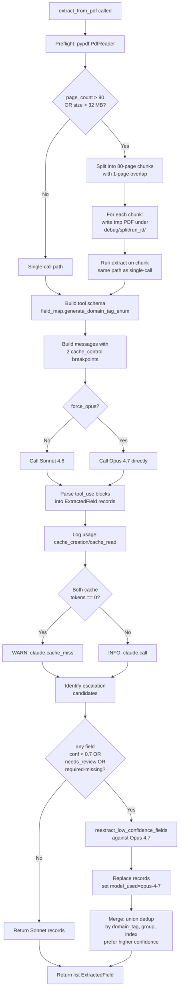
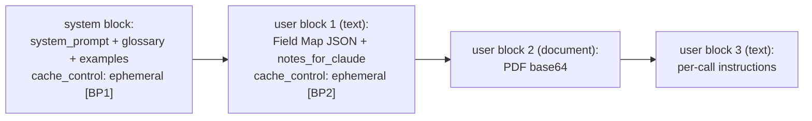
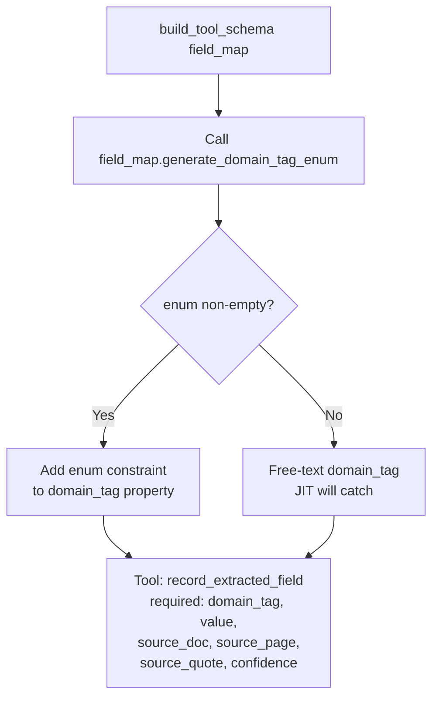
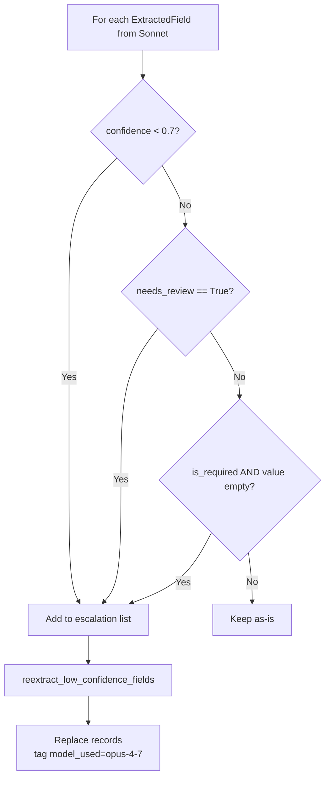
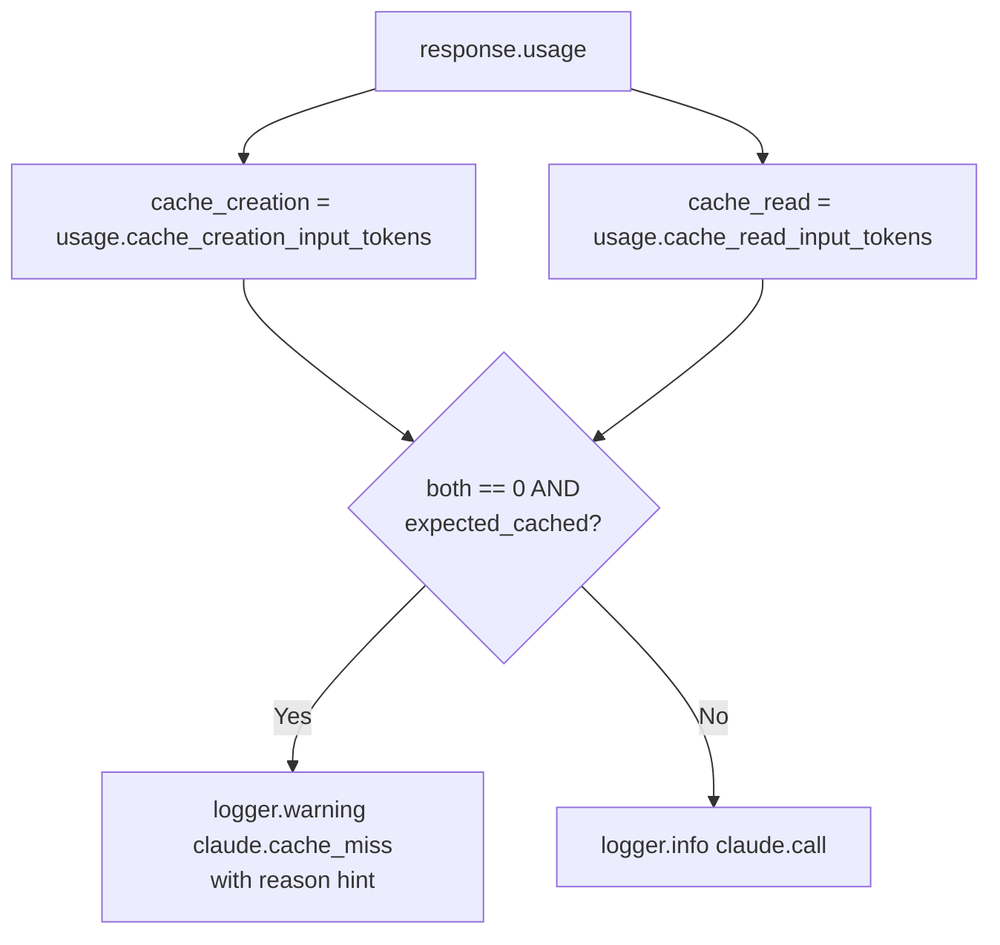
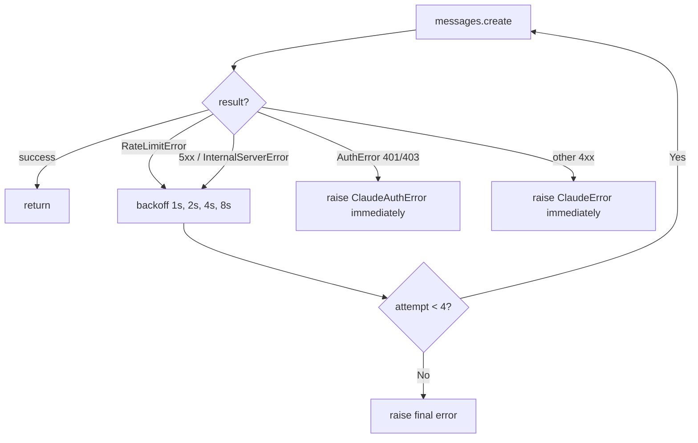

# DECISION-MAP — claude-client-agent

**Scope:** `src/iga_marketing_master_2/claude_client.py`
**Owner:** claude-client-agent
**Status:** Implementing
**SDK pin:** `anthropic>=0.42` (confirmed against installed 0.97.0 — `usage.cache_creation_input_tokens` and `usage.cache_read_input_tokens` exist as documented; no rename needed)

---

## Top-level flow: `extract_from_pdf`



---

## Cache breakpoint placement

Per ARCHITECTURE.md §6.3:



Both BP1 (5–15K tokens expected) and BP2 (50–80K tokens expected) clear Sonnet 4.6's 2,048-token cache minimum. Verified by tests with explicit token-count fixtures.

---

## Tool schema build



---

## Auto-escalation gate



---

## Cache verification



---

## Retry with backoff



---

## --debug artifact saving

When `debug_dir` is provided:

```
<debug_dir>/<doc_id>-call_<n>.req.json   # full request body, PDF base64 elided to sha256
<debug_dir>/<doc_id>-call_<n>.resp.json  # full response JSON including usage block
```

Caller (extract.py) is responsible for constructing `debug_dir` as `<client>/debug/claude/<run_id>/`. The 5-run-id auto-prune lives in extract.py per ARCHITECTURE.md §6.7 / §10.

---

## SDK verification (open item §14 #2)

- Pinned: `anthropic>=0.42` (note in module-level comment — minimum version that supports Sonnet 4.6 + post-Sonnet-4.6 tool/cache APIs).
- Verified locally against `anthropic==0.97.0`:
  - `Message.usage` exists. `usage.cache_creation_input_tokens` and `usage.cache_read_input_tokens` exist on the `Usage` model. Field names match ARCHITECTURE.md §6.5 exactly — no rename required.
  - Error hierarchy: `RateLimitError`, `InternalServerError`, `AuthenticationError`, `PermissionDeniedError`, `BadRequestError`, all subclasses of `APIStatusError → APIError → AnthropicError`.
  - Mapping to module exceptions:
    - `AuthenticationError`, `PermissionDeniedError` → `ClaudeAuthError`
    - `RateLimitError` → `ClaudeRateLimitError` (retryable)
    - `InternalServerError` and other 5xx (`status_code >= 500`) → `ClaudeServerError` (retryable)
    - Other `APIStatusError` → `ClaudeError` (non-retryable, surface immediately)

No deviations from ARCHITECTURE.md required.
