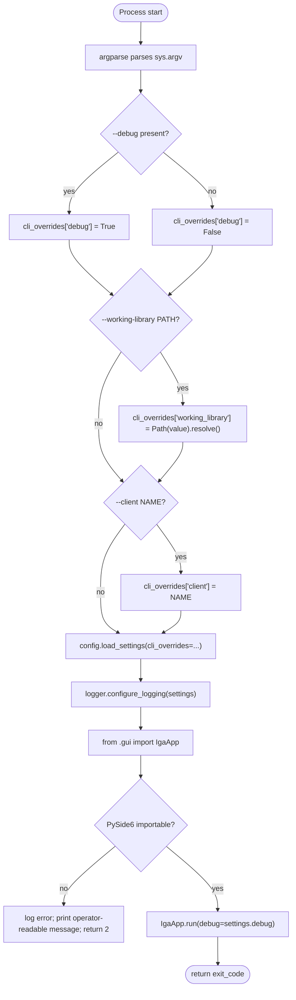
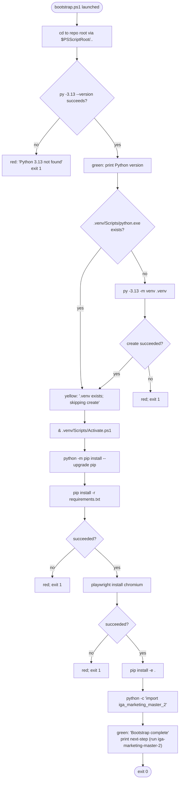

# DECISION-MAP — config-and-cli-agent

**Scope:** `cli.py`, `config.py`, `logger.py`, `secret_store.py`, `scripts/bootstrap.ps1`
**Author:** config-and-cli-agent
**Date:** 2026-04-30
**Authoritative reference:** [ARCHITECTURE.md](ARCHITECTURE.md) §§ 2, 9, 10, 13, 14

---

## A. CLI flag handling (`cli.py::main`)



Notes:
- `--client` is captured into the `Settings.cli_initial_client` (a non-frozen attribute would break `frozen=True`; we surface `cli_initial_client` as a Settings field with default `None`).
- `import` of `gui` is deferred to inside `main()` so unit tests of `cli.parse_args()` do not require PySide6 at collection time.

---

## B. Config load → first-run path picker → API key prompt → app launch

```mermaid
flowchart TD
    Boot([cli.main calls load_settings]) --> CliOv{cli_overrides given?}
    CliOv -- yes --> ApplyOv["overlay over base"]
    CliOv -- no --> ReadCfg
    ApplyOv --> ReadCfg["read user_config_dir/config.json if present"]
    ReadCfg --> CfgExists{config.json exists?}
    CfgExists -- yes --> MergePersisted["merge persisted values\n(working_library, etc.)"]
    CfgExists -- no --> FirstRun["first_run = True; use defaults via platformdirs"]
    MergePersisted --> ValidatePaths
    FirstRun --> ValidatePaths["resolve all Paths to absolute"]
    ValidatePaths --> Build[Build Settings dataclass]
    Build --> Return([return Settings])

    Return --> GUIBoot([gui.IgaApp.run])
    GUIBoot --> CheckFirstRun{first_run AND not --working-library?}
    CheckFirstRun -- yes --> Picker["GUI first-run folder picker\n(owned by gui-agent)"]
    CheckFirstRun -- no --> CheckKey
    Picker --> SaveCfg["config.save_user_config(updated_settings)"]
    SaveCfg --> CheckKey{secret_store.get_anthropic_api_key() returns value?}
    CheckKey -- yes --> Launch["proceed into main window"]
    CheckKey -- no --> Prompt["GUI ApiKeyPromptDialog\n(owned by gui-agent)\nthen secret_store.set_anthropic_api_key()"]
    Prompt --> Launch
    Launch --> Loop([Qt event loop])
```

Notes:
- `secret_store.py` does NOT open Qt dialogs (would violate dep graph §11: `gui → secret_store`, never the reverse). The GUI owns the dialog; `secret_store` only provides `get/set/delete`.
- A console-fallback prompt (`prompt_for_anthropic_api_key_via_console`) is provided for headless/CI/first-run-without-Qt scenarios.

---

## C. Secret retrieval order (`secret_store.get_anthropic_api_key`)

```mermaid
flowchart TD
    Call([get_anthropic_api_key]) --> Env{os.environ['ANTHROPIC_API_KEY'] non-empty?}
    Env -- yes --> ReturnEnv([return env value])
    Env -- no --> Keyring{keyring.get_password(SVC, USER) returns non-None?}
    Keyring -- yes --> ReturnKR([return keyring value])
    Keyring -- no --> ReturnNone([return None])
    ReturnNone --> CallerDecides[caller decides:\nGUI prompt OR console prompt OR raise]
```

Notes:
- `set_anthropic_api_key` writes only to keyring. The env-var override is read-only.
- `keyring` errors (`keyring.errors.KeyringError`) become `SecretStoreError`.
- On Windows, `keyring` selects `WinVaultKeyring` (Credential Manager / DPAPI). No raw `pywin32` calls in this module.

---

## D. Logger init under `--debug` vs production (`logger.configure_logging`)

```mermaid
flowchart TD
    Cfg([configure_logging(settings)]) --> MkDir["log_dir.mkdir(parents=True, exist_ok=True)"]
    MkDir --> Root["root = logging.getLogger('iga')"]
    Root --> SetLvl{settings.debug?}
    SetLvl -- yes --> LvlDebug["root.setLevel(DEBUG)"]
    SetLvl -- no --> LvlInfo["root.setLevel(INFO)"]
    LvlDebug --> AddFile
    LvlInfo --> AddFile["RotatingFileHandler(log_dir/iga.log, 10MB x 5)"]
    AddFile --> Console{settings.debug?}
    Console -- yes --> AddCons["StreamHandler -> sys.stderr at DEBUG"]
    Console -- no --> AddConsInfo["StreamHandler -> sys.stderr at WARNING\n(operator sees launch errors only)"]
    AddCons --> NoProp
    AddConsInfo --> NoProp["root.propagate = False"]
    NoProp --> Done([return])
```

Decision — **Open Item §14 #4 — `log_dir` retention specifics:**

- **Chosen:** `RotatingFileHandler(maxBytes=10 MB, backupCount=5)` → ~50 MB max per app log.
- **Why:** Honors Architecture Appendix A constants (`LOG_FILE_MAX_BYTES = 10 * 1024 * 1024`, `LOG_FILE_BACKUP_COUNT = 5`) which the architecture-agent already codified. Same total envelope (~50 MB) as the prompt's `5 MB × 10` recommendation; differs only on per-file size. Larger files = fewer rolls, easier `tail -f` ergonomics; same disk footprint.
- **Per-client `runs.log`** is a separate handler attached to the `iga.run` logger by `configure_run_log(client_path)`. It does NOT rotate (per-run files are bounded by run length; a long-lived client folder may grow but operators expect the audit trail to persist). The architecture says "`runs.log` is part of normal operation" (§10) without specifying rotation; we keep it simple.

---

## E. Bootstrap script (`scripts/bootstrap.ps1`)



Idempotency points:
1. `.venv` create skipped if `.venv/Scripts/python.exe` exists.
2. `pip install -r requirements.txt` is naturally idempotent (no-op if satisfied).
3. `playwright install chromium` is naturally idempotent.
4. `pip install -e .` reinstalls the package in editable mode (idempotent — pip detects existing install).

Failure surfacing: each failing step prints red `[FAIL]` lines and `exit 1`. Successes print green `[OK]` lines.
