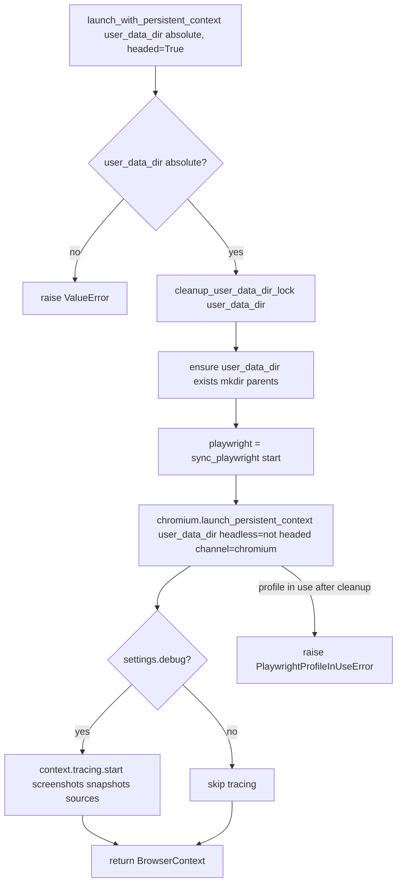
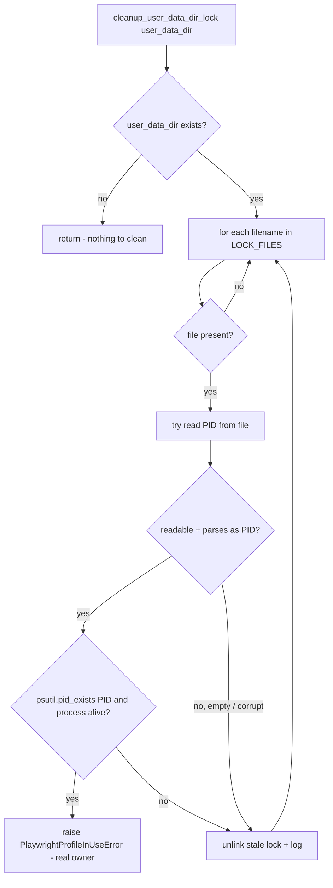
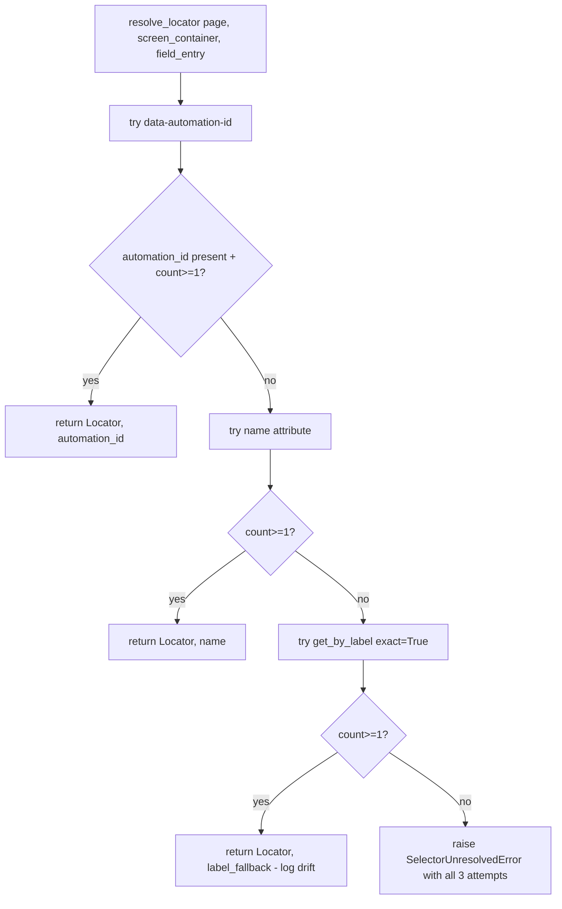
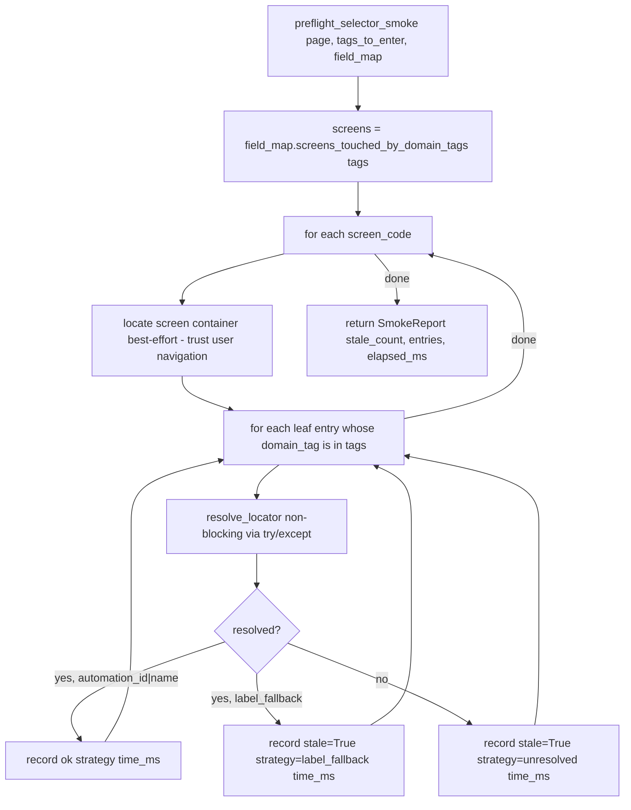

# DECISION-MAP — epic-driver-agent

**Owner:** epic-driver-agent
**Scope:** `src/iga_marketing_master_2/epic_session.py`, `src/iga_marketing_master_2/enter.py`
**Authoritative contract:** ARCHITECTURE.md §§4, 5, 7, 10, 13, 14
**Plan amendments:** PLAN-REVIEW.md #5 (OperatorModal callback), #6 (pre-flight smoke), #16 (Playwright pinning + lock cleanup)
**Research findings:** RESEARCH.md Finding 4 (Playwright Windows quirks)

---

## A. `epic_session.launch_with_persistent_context`



---

## B. `epic_session.cleanup_user_data_dir_lock`



**LOCK_FILES cleaned (final list):**

- `SingletonLock` (Chromium primary lock; symlink on POSIX, regular file on Windows)
- `SingletonCookie` (Chromium auxiliary)
- `SingletonSocket` (Chromium auxiliary; UNIX socket symlink ignored on Windows but listed for completeness)
- `LOCK` (LevelDB / IndexedDB lock occasionally orphaned)
- `lockfile` (Firefox-style lock file; harmless if absent)
- `parent.lock` (some Chromium subdir locks; matched only at top level)

If a `SingletonLock` is a Windows hardlink/symlink and points at a process, the readlink target form `pid-host` is parsed and only the PID is checked; an unreachable hostname is treated as stale.

---

## C. `epic_session.resolve_locator`



Strategy values: `"automation_id"` | `"name"` | `"label_fallback"`. The `label_fallback` strategy is logged at WARNING; the orchestrator may later wire `field_map.update_field()` to record drift but `resolve_locator` does **not** call into `field_map` directly (decoupling — keeps `epic_session` free of `field_map` write coupling).

---

## D. `epic_session.preflight_selector_smoke`



Time budget: 2-5s typical. If elapsed > 30s, log a warning. Never raises — pre-flight is purely advisory per amendment #6.

---

## E. `enter.run_entry_session`

```mermaid
flowchart TD
    A[run_entry_session state, field_map, browser_context, on_pause_callback, settings] --> B[run_id = uuid4]
    B --> C{settings.debug?}
    C -- yes --> Cd[ensure debug_dir; tracing already started by epic_session]
    C -- no --> D
    Cd --> D[approved_units = collect approved fields + repeatable items in deterministic order]
    D --> E[tags = domain_tags from approved_units]
    E --> F[smoke_report = preflight_selector_smoke page tags field_map]
    F --> G{any stale?}
    G -- yes --> Gw[log warning, attach to result.warnings, do NOT block]
    G -- no --> H
    Gw --> H
    H --> I[for each unit in approved_units]
    I --> J[entry = field_map.lookup_by_domain_tag tag]
    J --> K{entry found?}
    K -- no --> Kskip[skip + count fields_skipped]
    K -- yes --> L[try resolve_locator]
    L -- ok --> M[fill_field locator, value, entry]
    L -- SelectorUnresolvedError --> P1[reason=selector_unresolved => pause]
    M --> N[validate read-back - locator.input_value or appropriate read]
    N -- ok --> N2[set status=entered, write history, save_atomic]
    N -- mismatch / EPIC error --> P2[reason=validation_rejected => pause]
    N2 --> I
    P1 --> Pause
    P2 --> Pause
    subgraph Pause [pause-for-human]
        Pa[build PendingPause] --> Pb[state.set_pending_pause + save_atomic]
        Pb --> Pc[on_pause_callback returns resume|skip|abort]
        Pc -- resume --> Pd[re-read DOM via locator.input_value]
        Pd --> Pe[write field with actor=user action=resumed_after_pause]
        Pe --> Pf[clear pending_pause + save]
        Pc -- skip --> Pg[leave status=approved, log, clear pause]
        Pc -- abort --> Ph[clear pause, return EntryResult outcome=aborted]
    end
    Pf --> I
    Pg --> I
    Ph --> Z
    I -- done --> Y[append run_history entry kind=entry, outcome=completed|paused]
    Y --> Z[save_atomic + return EntryResult]
```

---

## F. Repeatable iteration ordering

For each repeatable group present in `state.repeatables`, iterate items in array order (state-agent guarantees ordered arrays per ARCHITECTURE §5.2). Within an item, fields are iterated in `domain_tag` lexical order so the order is deterministic and reproducible across runs.

---

## G. Field type fill semantics

| Field type / hint | Fill action | Read-back |
|---|---|---|
| `text` / hint=`text` | `locator.fill(str(value))` | `locator.input_value()` |
| `date` / hint=`date` | `locator.fill(iso_or_us(value))` | `locator.input_value()` |
| `select` / hint=`combo` | `locator.select_option(value)` (validate against `entry.enum_values` first if present) | `locator.input_value()` |
| `checkbox` | `locator.check()` if truthy else `locator.uncheck()` | `locator.is_checked()` |
| `textarea` | `locator.fill(str(value))` | `locator.input_value()` |
| `currency` (hint heuristic) | normalize to `"1234.56"` then `locator.fill` | `locator.input_value()` |

EPIC validation errors are detected by:

1. Read-back value mismatching the intended value after a 250 ms debounce, OR
2. A red error message element appearing relative to the field container (`screen_container.locator(":scope .error, [role=alert]").first`).

---

## H. Decoupling rule

`enter.py` calls `on_pause_callback(pause_info)` which is provided by `gui.py`. `enter.py` **never imports `gui`**. The callback returns one of `"resume" | "skip" | "abort"`. Module-level mention only — the GUI passes a closure that opens an `OperatorModal` subclass.

---

## I. `--debug` discipline

When `settings.debug` is True:

- `epic_session.launch_with_persistent_context` calls `context.tracing.start(screenshots=True, snapshots=True, sources=True)` immediately after launch.
- `enter.run_entry_session` saves `<client>/debug/playwright/<run_id>/trace.zip` on session end (via `context.tracing.stop`).
- Per-action screenshot before/after each fill: `<client>/debug/playwright/<run_id>/{n:04d}-{action}-{phase}.png`.
- After completion, **auto-prune** to last 5 run_id directories under `<client>/debug/playwright/` by mtime, oldest deleted.

When `settings.debug` is False:

- Tracing not started; no screenshots; no `<client>/debug/playwright/` writes.
- `runs.log` (per-client) still written via the standard logger handler.

---

## J. Open items affecting this agent

- ARCHITECTURE §14 lists 8 open items; none are routed *to* this agent. We document the lock-file list (above) and pin Playwright >=1.55 in the module-level requirements comment.
- Potential cross-agent follow-up (not in scope): orchestrator may later wire `epic_session.resolve_locator` drift events to call `field_map.update_field({"last_verified_at": ...})`. We log enough today (`strategy_used`, `screen_code`, `name`) that a future pass can reconstruct that.
