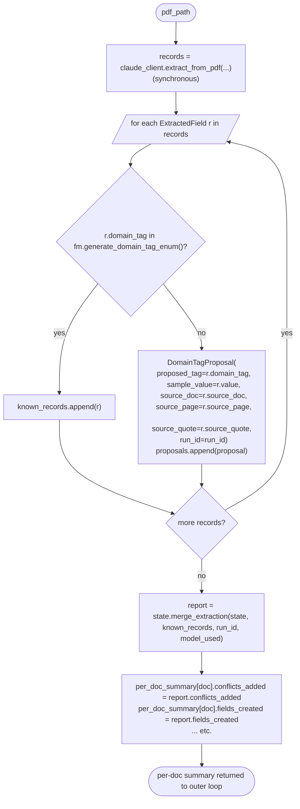
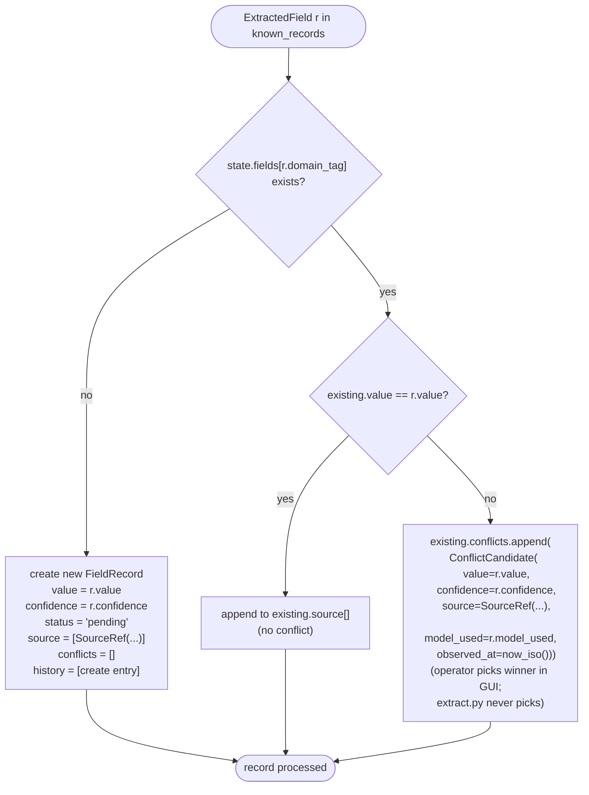
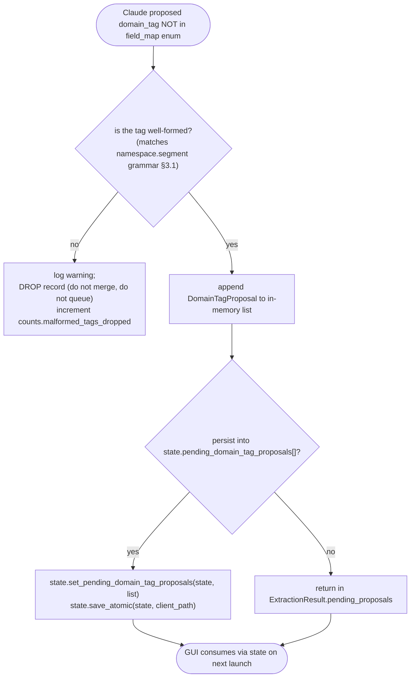
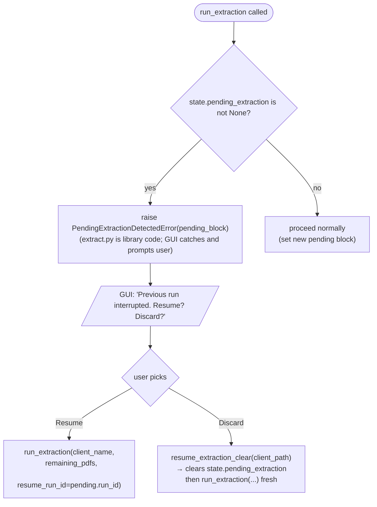

# DECISION-MAP — extraction-agent

**Scope:** `src/iga_marketing_master_2/extract.py`, `tests/test_extract.py`
**Author:** extraction-agent
**Date:** 2026-04-30
**Authoritative reference:** [ARCHITECTURE.md](ARCHITECTURE.md) §§ 2 (naming), 4 (Field Map I/O), 5 (state.json + state.py I/O), 6 (claude_client contract), 12 (data flow narrative), 14 #5 (PDF doc_id strategy)

---

## A. End-to-end orchestration (`extract.run_extraction`)

```mermaid
flowchart TD
    Start([run_extraction(client_name, pdf_paths, force_opus)]) --> Validate{"pdf_paths non-empty?"}
    Validate -- no --> Empty["raise ExtractionInputError"]
    Validate -- yes --> DupGuard{"any duplicate basenames?"}
    DupGuard -- yes --> DupErr["raise DuplicatePdfBasenameError\n(operator must rename or skip)"]
    DupGuard -- no --> CheckExist{"every pdf_path is_file()?"}
    CheckExist -- no --> Missing["raise ExtractionInputError(missing files)"]
    CheckExist -- yes --> ResolveClient["client_path = settings.working_library / client_name\nclient_path.mkdir(parents=True, exist_ok=True)"]
    ResolveClient --> LoadState["state.load(client_path)"]
    LoadState --> CheckResume{"state.pending_extraction is not None?"}
    CheckResume -- yes --> Surface["raise PendingExtractionDetectedError\nwith pending block payload\n(GUI calls run_extraction again with resume= or discard= flag)"]
    CheckResume -- no --> LoadFM["field_map.load()"]
    LoadFM --> NewRun["run_id = uuid4(); started_at = now_iso()"]
    NewRun --> SetPending["state.set_pending_extraction(state, PendingExtraction(\n  run_id, started_at,\n  pdf_paths=[str(p) for p in pdf_paths],\n  completed_pdf_basenames=[]))\nstate.save_atomic(state, client_path)"]
    SetPending --> Loop[/"for each pdf_path in pdf_paths"/]
    Loop --> CallClaude["claude_client.extract_from_pdf(\n  pdf_path, fm, glossary, system_prompt,\n  force_opus=force_opus, run_id=run_id,\n  debug_dir=client_path/'debug'/'claude'/run_id)"]
    CallClaude --> CatchErr{"raised ClaudeError?"}
    CatchErr -- yes --> RecordFail["log error;\nrun_failed=True; break"]
    CatchErr -- no --> Split["split records → known_records, unknown_proposals\nby checking domain_tag against fm enum"]
    Split --> QueueProp["append unknown_proposals\nto pending_proposals[]"]
    QueueProp --> Merge["state.merge_extraction(state, known_records, run_id, model_used)\n→ MergeReport"]
    Merge --> Append["pending.completed_pdf_basenames.append(basename)\nstate.set_pending_extraction(state, pending)"]
    Append --> SaveDoc["state.save_atomic(state, client_path)"]
    SaveDoc --> NextDoc{"more docs?"}
    NextDoc -- yes --> Loop
    NextDoc -- no --> Finalize{"run_failed?"}
    Finalize -- yes --> HistFail["append_run_history(state, RunHistoryEntry(\n  outcome='aborted', ...))"]
    Finalize -- no --> HistOK["append_run_history(state, RunHistoryEntry(\n  outcome='completed', model_used=..., ...))"]
    HistFail --> ClearPending
    HistOK --> ClearPending["state.set_pending_extraction(state, None)"]
    ClearPending --> FinalSave["state.save_atomic(state, client_path)"]
    FinalSave --> StashProp["if pending_proposals: state.set_pending_domain_tag_proposals(state, proposals)\nstate.save_atomic(...)"]
    StashProp --> AggCost["aggregate cache stats from per-doc summaries\nlog at INFO"]
    AggCost --> ReturnRes(["return ExtractionResult(\n  run_id, counts, per_doc_summary,\n  total_cost, conflicts_surfaced,\n  pending_proposals)"])
```

Notes / contract:
- Every transition between numbered steps logs at INFO under `iga.extract`.
- `glossary` and `system_prompt` are loaded once per run (not per doc) — they are constant across the loop and feed Breakpoint 1 of the prompt cache.
- `cache_stats` aggregation: each `claude_client.extract_from_pdf` is expected to record cache_creation / cache_read tokens via the logger; `extract.py` consumes the per-doc `model_used` and any cost summary the client surfaces (or computes its own from log records, if the client returns a summary tuple — see §C below).
- The extraction agent does **not** save the Field Map. JIT proposals are queued only.

---

## B. Per-PDF processing (inside the loop)



---

## C. Conflict detection contract (delegated to `state.detect_conflicts` / `state.merge_extraction`)



The extraction-agent's job is to invoke `state.merge_extraction` and surface the resulting `MergeReport.conflicts_added` count in the `ExtractionResult`. It does **not** call `detect_conflicts` directly — that's an internal helper of `state.py`.

---

## D. JIT domain_tag proposal queue



**Contract with GUI / Field Map:**
- `extract.py` NEVER calls `field_map.update_field`.
- `extract.py` NEVER calls `field_map.save_atomic`.
- Proposals are surfaced to the GUI via:
  1. Synchronous return value `ExtractionResult.pending_proposals` (when the GUI is driving the run live).
  2. Persistent `state.pending_domain_tag_proposals` block (so a crash before GUI handoff doesn't lose the proposal).
- The GUI confirms / edits / rejects each. On confirm, the GUI calls `field_map.update_field(...)` and `field_map.save_atomic(...)`, then clears the proposal from state.

**Malformed-tag policy:** if Claude proposes a tag that violates the §3.1 grammar (e.g., uppercase, hyphenated, no dot), we drop it with a logged warning. We do not surface garbage proposals to the operator.

---

## E. `pending_extraction` crash safety



API surface for the GUI:
- `run_extraction(...)` raises `PendingExtractionDetectedError` when a stale pending block is detected. The error carries `.pending` so the GUI can render the prompt.
- `resume_extraction_clear(client_path)` discards a pending block (no run, just clears).
- Resume uses the same `run_extraction(...)` with the un-completed PDFs.

---

## F. doc_id strategy — RESOLVED OPEN ITEM (ARCHITECTURE.md §14 #5)

**Decision: `doc_id = pdf_path.name` (basename, including the `.pdf` extension).**

| Concern | Basename (chosen) | Content hash (rejected) |
|---|---|---|
| Human readability in `state.json` | High — operator recognizes `renewal-dec.pdf` instantly | Low — `sha256:a1b2...` is opaque |
| Stability across re-extractions | Stable as long as the file isn't renamed | Stable across renames; changes if the bytes change (e.g., re-OCR) |
| Cross-client collision risk | None within a single client (Working Library is per-client) | None |
| Within-run collision risk | **Real** — two PDFs dropped in one run with the same basename collide | None |
| Cost to compute | Free (string manipulation) | I/O + CPU per PDF |

**Mitigation for the within-run collision:** before any API call, `extract.py` checks for duplicate basenames in `pdf_paths`. If detected, it raises `DuplicatePdfBasenameError` with a message naming the offending basename and listing the conflicting paths. The operator is asked to rename or skip one of the files. We do not silently disambiguate (would lose audit trail clarity) and we do not auto-hash (would lose readability).

**Tradeoff accepted:** if the operator manually re-OCRs a PDF and overwrites the file in place, source quotes recorded in state will still reference the same `doc_id` even though the bytes changed. Acceptable for v1 single-user single-operator workflow; Phase 2 may revisit.

---

## G. Logging surface

| Event | Level | Logger | Extra |
|---|---|---|---|
| run_extraction entry | INFO | `iga.extract` | client, run_id, doc_count, force_opus |
| pending block detected | WARNING | `iga.extract` | run_id (stale), started_at |
| per-doc start | INFO | `iga.extract` | run_id, doc, pages, size_mb |
| per-doc records returned | INFO | `iga.extract` | run_id, doc, records, known, unknown_tags |
| per-doc merge report | INFO | `iga.extract` | run_id, doc, fields_created, fields_updated, conflicts_added, repeatable_items_added |
| JIT proposal queued | INFO | `iga.extract` | run_id, doc, proposed_tag, sample_value |
| malformed tag dropped | WARNING | `iga.extract` | run_id, doc, raw_tag |
| duplicate basename guard fired | ERROR | `iga.extract` | basenames, paths |
| Claude error raised | ERROR | `iga.extract` | run_id, doc, error_type, message |
| run completed | INFO | `iga.extract` | run_id, outcome, total_records, total_conflicts, total_proposals |
| aggregated cache stats | INFO | `iga.extract` | run_id, total_cache_creation, total_cache_read, total_input, total_output |

---

## H. Module dependency boundary

`extract.py` imports (allowed): `field_map`, `state`, `claude_client`, `config`, `logger`.
`extract.py` does NOT import: `gui`, `enter`, `epic_session`, `secret_store`.

The GUI is the caller. `extract.py` exposes a synchronous, pure-Python public API; the GUI runs it on a worker thread.
