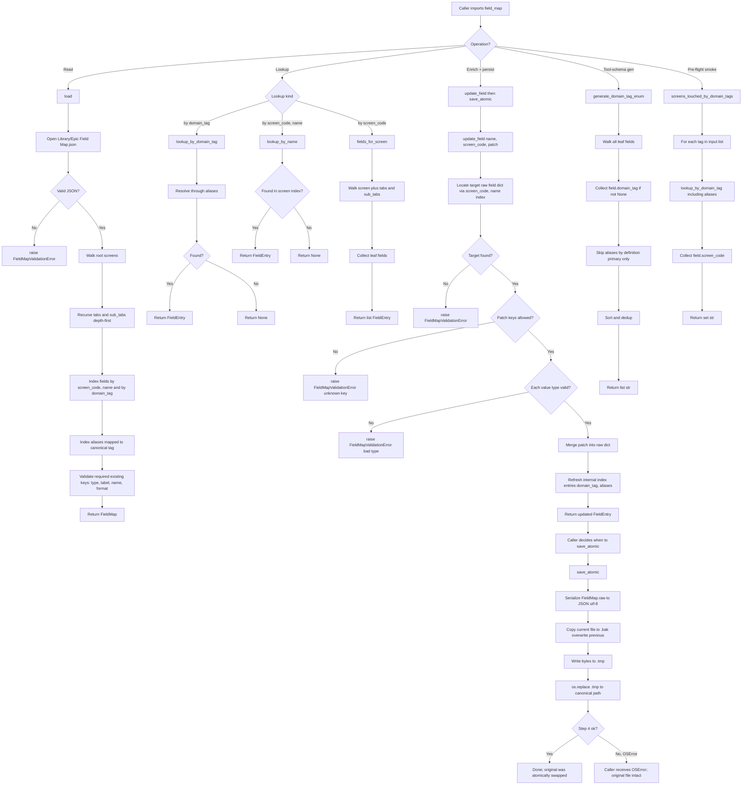

# DECISION-MAP — field-map-agent

**Agent scope:** `src/iga_marketing_master_2/field_map.py` + `tests/test_field_map.py`
**Authoritative refs:** ARCHITECTURE.md §§2, 3, 4, 13.6, 14.6 · PLAN-REVIEW.md amendment #11
**Path:** B (single-user; no `version` field; no compare-and-swap; no lock file)
**Last updated:** 2026-04-30

---

## Open-item ruling (ARCHITECTURE §14, item #6)

**Question:** When `update_field()` is called rapidly (e.g., GUI confirms 5 domain_tags in a row), do we flush per call or batch?

**Decision:** **`update_field()` is pure (mutates the in-memory `FieldMap` only). The caller is responsible for `save_atomic()`.** This matches the I/O contract in ARCHITECTURE §4.3 verbatim ("Caller is responsible for save_atomic() after batching updates"). The GUI may therefore choose per-call flush (default — correctness > throughput) or batched flush (after the user clicks Confirm All). No coupling either way.

**Rationale:**
- ARCHITECTURE §4.3 already specifies the split. Not the agent's call to override.
- At ~1,631 fields and a typical JIT batch of 1–20 patches per session, even per-call atomic write costs <50ms each on a local SSD — not a bottleneck.
- Forcing batching inside `update_field` would couple the I/O contract to a future GUI behavior, violating the single-responsibility split.
- If a future caller ever needs implicit flushing, they can wrap `update_field` + `save_atomic` in a helper.

**Documented behavior:** `update_field` does not write to disk. `save_atomic` is the only public function that touches disk for writes. The docstring on each makes this explicit.

---

## Flowchart

---

## Indexing strategy (internal, not part of public contract)

On `load()` the FieldMap builds three indices in memory:

| Index | Keyed by | Used by |
|---|---|---|
| `_by_screen_name` | `(screen_code, name)` | `lookup_by_name`, `update_field` |
| `_by_domain_tag` | primary `domain_tag` | `lookup_by_domain_tag`, `generate_domain_tag_enum` |
| `_aliases` | alias `domain_tag` -> primary `domain_tag` | `lookup_by_domain_tag` resolution |

Indices point at the same raw dict objects that live inside `field_map.raw`. Mutations from `update_field` are reflected in indices via a small `_reindex_field` helper that runs after every patch — keeping indices and raw in sync without re-walking the whole tree.

Screens with `screen_code: null` (a handful exist; e.g., parent placeholders like `"Commercial AP"` with `has_children: true`) are still walked but their fields (if any — usually none) are not addressable by the `(screen_code, name)` index. Their nested children (which DO have `screen_code`) are reachable normally.

---

## Atomic write protocol (Field Map; ARCHITECTURE §4.4)

1. Compute new JSON bytes (UTF-8, indent=2, no BOM, `ensure_ascii=False`).
2. If canonical file exists: copy bytes to `Library/Epic Field Map.json.bak` (overwrites previous bak).
3. Write new bytes to `Library/Epic Field Map.json.tmp`.
4. `os.replace(tmp, canonical)` — atomic on Windows for same-volume files.
5. On any failure before step 4 completes, the canonical file is intact; caller receives the underlying `OSError`.

Path B = single-user. No lock file, no version, no CAS.

---

## Error model

| Exception | When raised |
|---|---|
| `FieldMapValidationError` | Broken JSON; missing required existing keys (`type`, `label`, `name`, `format`); unknown patch key; patch value of wrong type; field referenced by `update_field` not found. |
| `OSError` (passes through) | Disk full, permission, network drive disconnect during `save_atomic`. Caller (state.py / GUI) surfaces via `OperatorModal`. |

Both inherit per ARCHITECTURE §13.12 (own subtree rooted at `FieldMapValidationError`, base `Exception`).

---

## Why `version` is absent

PLAN-REVIEW amendment #11 + ARCHITECTURE §4.2 ("Explicitly NOT in the schema: `version` ... Plain atomic write. No compare-and-swap.").

`schema_version` is on `state.json` (different file, different concern — ARCHITECTURE §13.3). It does NOT apply to the Field Map.
