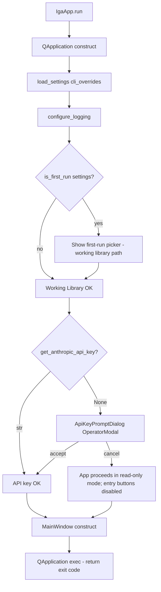
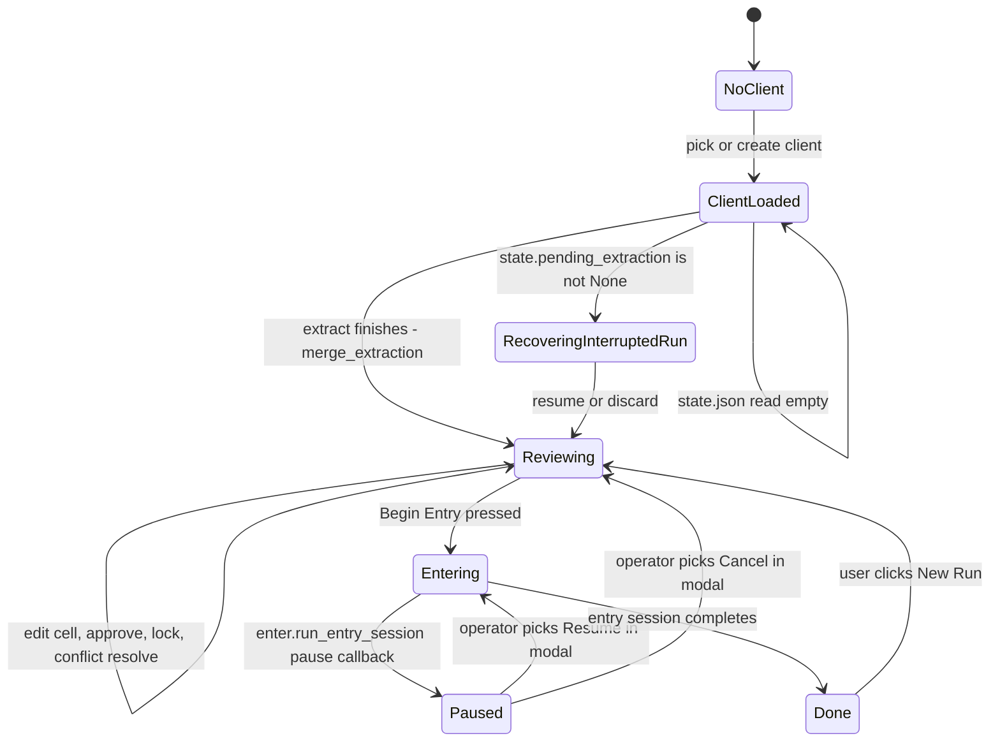
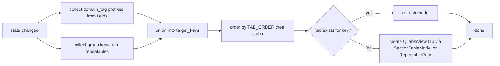
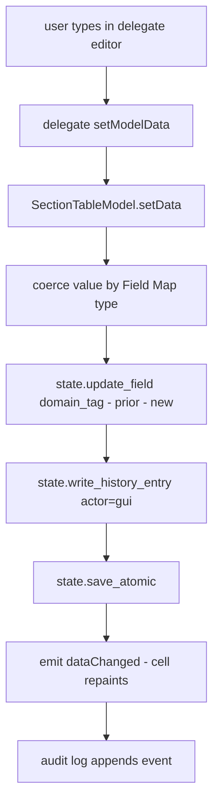
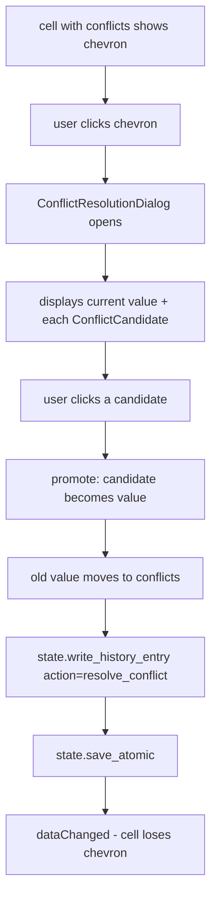
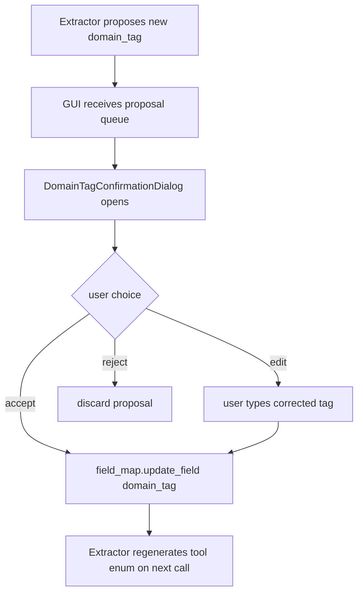
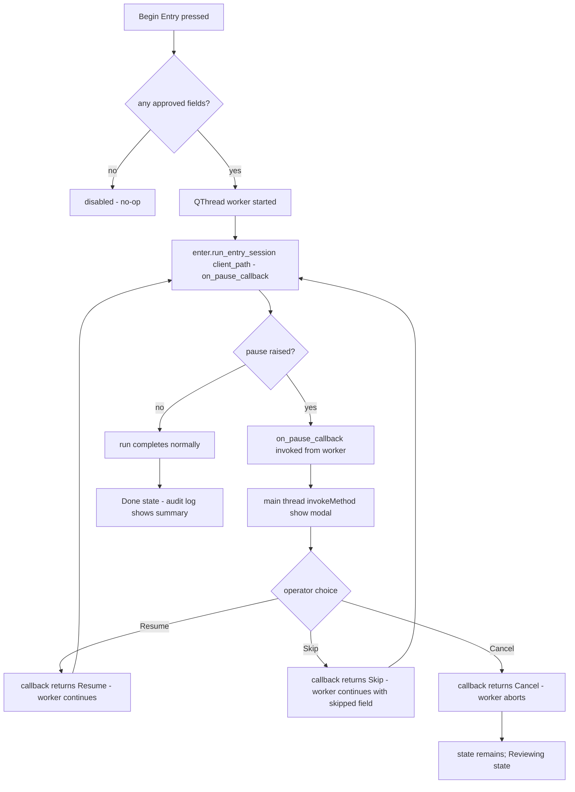

# DECISION-MAP — gui-agent

Owner: gui-agent
Scope: PySide6 review/edit GUI under `src/iga_marketing_master_2/gui/` plus the
top-level `gui.py` entry shim.

This document records the rulings the gui-agent makes against open items and
the state-machine + flowcharts the build follows. It is referenced by the
implementation files and by `STATUS_gui-agent.md`.

---

## 1. Open-item ruling — section-tab derivation (ARCHITECTURE.md §14 #3)

The plan asks for tab derivation from the populated state, not a hardcoded
list. The gui-agent's ruling:

1. **Tabs derive from the union of two sources:**
   - top-level namespaces present in `state.fields` (split each
     `domain_tag` on `.`, keep the part(s) that form the tab key, see (3)),
   - keys present in `state.repeatables`.
2. **An always-on "All" / "Submission" anchor tab** is included even on a
   blank state so the user sees a usable surface before extraction has run.
3. **Tab key = the first segment of the domain_tag, with one nesting
   exception:** `policy.<lob>.*` rolls up to `policy.<lob>` so each LOB
   gets its own tab (per ARCHITECTURE §3.2). All other namespaces collapse
   to their first segment.
4. **Friendly labels via a static `TAB_LABELS` map**; missing entries fall
   back to a title-cased namespace string. Order is governed by
   `TAB_ORDER`; unknown keys append at the end alphabetically.
5. **Re-derivation is automatic** on any state change (model `dataChanged`
   or repeatable add/delete signal). Implemented by
   `MainWindow._rebuild_tabs()` which diffs current tabs vs. target.

`TAB_LABELS` (initial vocabulary):

```python
TAB_LABELS = {
    "submission": "Submission",
    "account": "Account",
    "producer": "Producer",
    "policy.gl": "General Liability",
    "policy.auto": "Auto",
    "policy.property": "Property",
    "policy.workers_comp": "Workers Comp",
    "policy.umbrella": "Umbrella",
    "policy.crime": "Crime",
    "policy.cyber": "Cyber",
    "policy.inland_marine": "Inland Marine",
    "policy.professional": "Professional",
    "policy.directors_officers": "D&O",
    "policy.employment_practices": "EPL",
    "policy.pollution": "Pollution",
    "vehicle": "Vehicles",
    "driver": "Drivers",
    "location": "Locations",
    "loss_payee": "Additional Interests",
    "additional_insured": "Additional Insureds",
    "prior_carrier": "Prior Carriers",
    "loss": "Loss History",
}
```

`TAB_ORDER` lists those keys in the order the tabs appear; new namespaces
discovered in state but absent from the order list are appended at the end
in alphabetical order.

---

## 2. App-launch flow



---

## 3. Main-window state machine



**Begin Entry gating rule:** the button is enabled iff at least one
`FieldRecord` in the current state has `status == "approved"`. Otherwise the
button is greyed out and a tooltip explains why.

---

## 4. Tab-derivation flow



---

## 5. Cell-edit flow



Edits set `confidence = 1.0` (per ARCHITECTURE §8.4), `status` becomes
`"approved"` if it was `"pending"`, and `model_used` is preserved (the
canonical-source attribution doesn't change just because the human edited
the value).

---

## 6. Conflict-resolve flow



---

## 7. Domain-tag confirmation flow



---

## 8. Begin Entry / pause / resume flow



---

## 9. OperatorModal class hierarchy

```
OperatorModal (QDialog)
  - DomainTagConfirmationDialog
  - ConflictResolutionDialog
  - EpicValidationPauseDialog
  - SelectorUnresolvedPauseDialog
  - ApiKeyPromptDialog
  - RecoverInterruptedRunDialog
```

Constructor enforces the 4-part structure (`headline`, `what_to_do`,
`cancel_effect`, optional `technical_detail`). Buttons are typed
`OperatorAction(label, role, return_value)`. Default action sets per
ARCHITECTURE §13 #9.

---

## 10. Confidence-color rule (table)

| Confidence | Background |
|---|---|
| status == approved | no tint |
| status == locked   | no tint, lock icon |
| status == entered  | very pale green tint |
| confidence >= 0.85 | no tint |
| 0.6 <= confidence < 0.85 | pale yellow `#FFF7CC` |
| confidence < 0.6   | pale red `#FFD6D6` |
| missing / null     | pale red `#FFD6D6` |

Implemented in `gui/section_table.py::SectionTableModel.data` for the
`Qt.BackgroundRole` branch.

---

## 11. Module / file layout

```
src/iga_marketing_master_2/
  gui.py                  -> thin shim re-exporting IgaApp + OperatorModal
  gui/
    __init__.py
    main_window.py        -> MainWindow, IgaApp, tab derivation
    operator_modal.py     -> OperatorModal + 6 subclasses + OperatorAction
    section_table.py      -> SectionTableModel + delegates + view
    repeatable_pane.py    -> RepeatablePane (list+form pattern)
    pdf_preview.py        -> PdfPreview (QPdfView wrapper)
    audit_log.py          -> AuditLogPane (read-only QPlainTextEdit)
    run_controls.py       -> RunControlsBar
```

The top-level `gui.py` keeps the import surface
(`from iga_marketing_master_2.gui import IgaApp, OperatorModal, ...`) flat
for `cli.py`.

---

## 12. Dependency boundary

The GUI imports `state`, `field_map`, `config`, `logger`, `extract`,
`enter`, `secret_store`. It never imports `claude_client`, `epic_session`
directly — those are exercised through `extract` / `enter`.

The GUI never reads or writes JSON directly; all persistence flows through
`state.save_atomic` and `field_map.update_field`. This is enforced by code
review and mirrors ARCHITECTURE §8.7.
