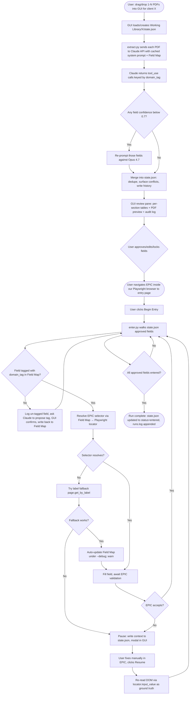

# Process Map — IGA Marketing Master 2.0

End-to-end visual flow from "user has PDFs on the desk" to "data is in EPIC." See [PLAN.md](PLAN.md) for the full plan.

## Major decision points

| Branch | Trigger | Outcome |
|---|---|---|
| `D1` | Any extracted field confidence `< 0.7` (or `needs_review` flag, or required-field missing) | Re-prompt only those fields against Opus 4.7; merge results back |
| `K` | Field encountered during entry has no `domain_tag` in Field Map | JIT propose-and-confirm via Claude + GUI; write back to Field Map |
| `M` / `M2` | EPIC selector doesn't resolve | Try `data-automation-id` → `name` attribute → label fallback; pause if all fail |
| `O` | EPIC rejects entered value (validation error) | Pause for human; on resume, accept post-fix DOM value as ground truth |

## Living document

This map updates whenever `/plan-review` or `/build` discovers new branches (e.g., new failure modes in EPIC, new auto-escalation triggers).
